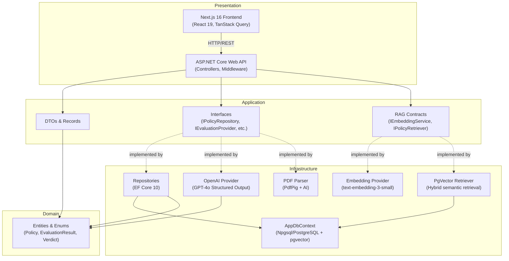
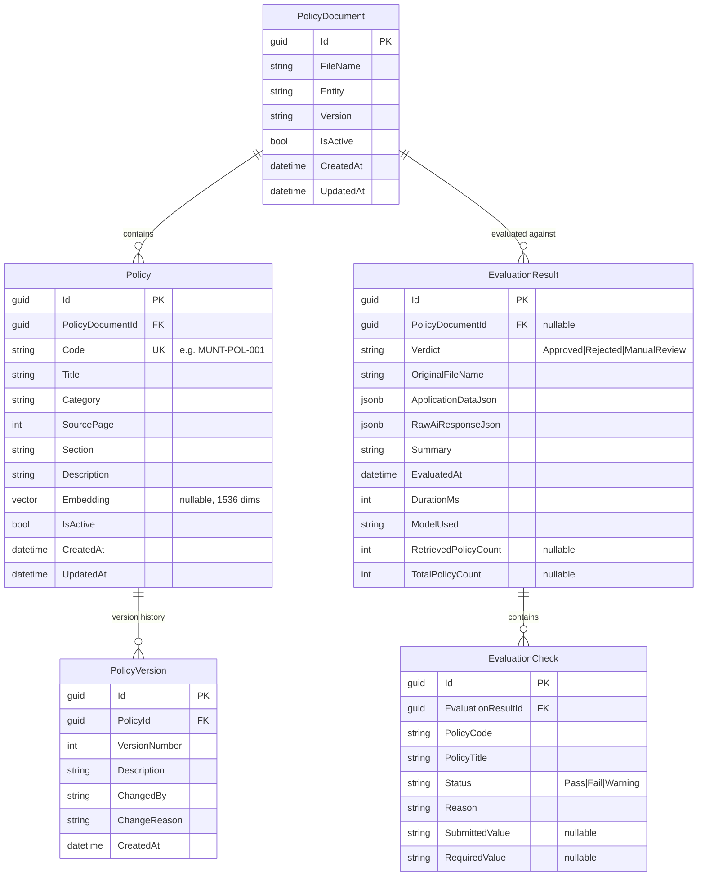
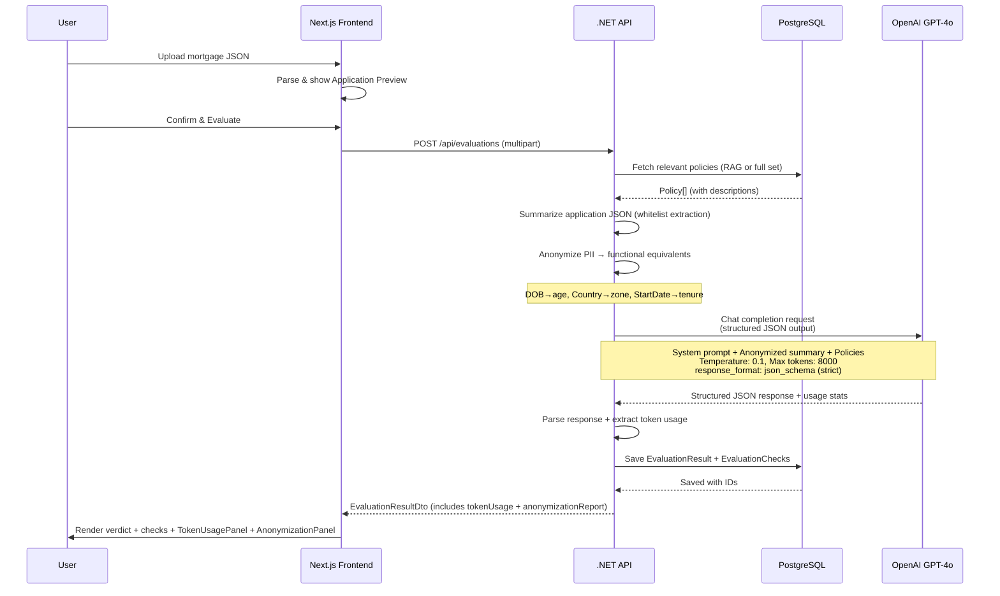
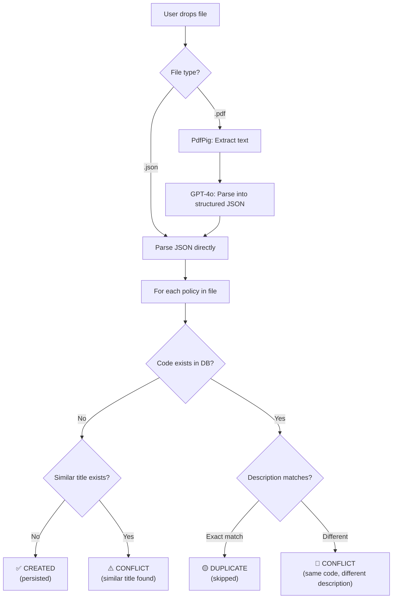
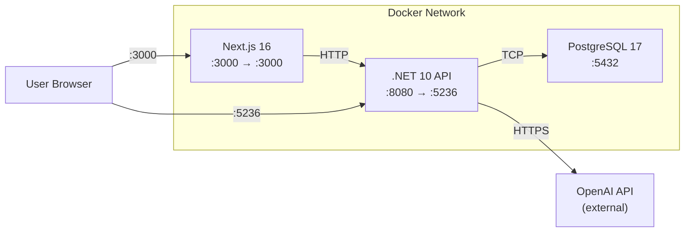
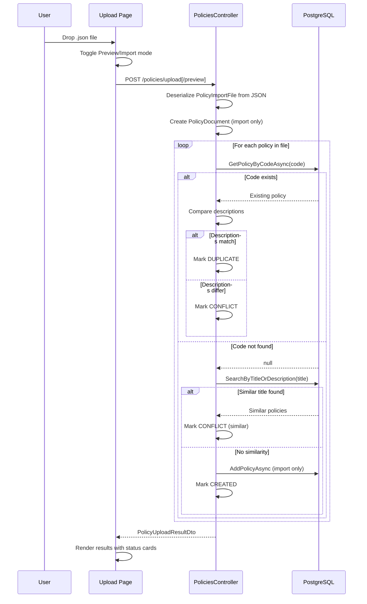
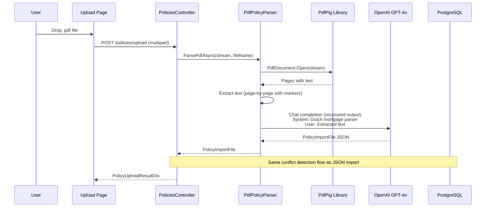
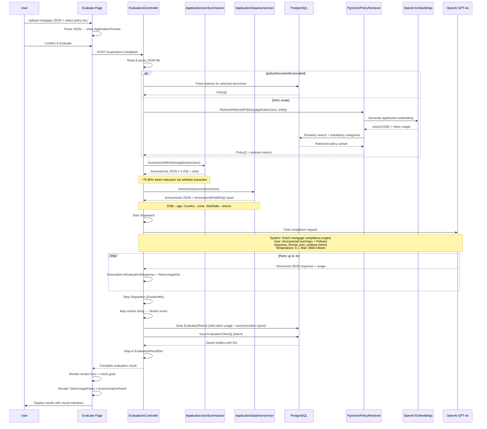

# PolicyEngine — AI-Powered Mortgage & Contract Validation Engine

## Complete Application Documentation

**Version:** 1.0.0  
**Last Updated:** February 26, 2026  
**Platform:** .NET 10 + Next.js 16 + PostgreSQL 17

---

## Table of Contents

1. [Executive Summary](#1-executive-summary)
2. [System Architecture](#2-system-architecture)
3. [Technology Stack](#3-technology-stack)
4. [Solution Structure](#4-solution-structure)
5. [Domain Model](#5-domain-model)
6. [Backend — API Reference](#6-backend--api-reference)
7. [Backend — Application Layer](#7-backend--application-layer)
8. [Backend — Infrastructure Layer](#8-backend--infrastructure-layer)
9. [Frontend — Web Application](#9-frontend--web-application)
10. [AI Integration](#10-ai-integration)
11. [Policy File Upload & Conflict Detection](#11-policy-file-upload--conflict-detection)
12. [Database Design](#12-database-design)
13. [Security Considerations](#13-security-considerations)
14. [Deployment & Infrastructure](#14-deployment--infrastructure)
15. [Configuration Reference](#15-configuration-reference)
16. [Design System & UI Tokens](#16-design-system--ui-tokens)
17. [Data Flow Diagrams](#17-data-flow-diagrams)
18. [API Endpoint Quick Reference](#18-api-endpoint-quick-reference)
19. [Troubleshooting](#19-troubleshooting)
20. [Appendix — Sample Data Files](#20-appendix--sample-data-files)

---

## 1. Executive Summary

PolicyEngine is a **commercial-grade, B2B SaaS web application** designed for financial underwriters and mortgage advisors in the Dutch market. It provides:

- **Policy Management** — CRUD operations for mortgage policies with version auditing, conflict detection, and bulk import from JSON/PDF files.
- **AI-Powered Evaluation** — Upload mortgage application data (JSON) and evaluate it against a dynamic database of business policies using OpenAI GPT-4o with structured output.
- **RAG-Powered Policy Retrieval** — Uses OpenAI embeddings + pgvector semantic search to retrieve only the most relevant policies before evaluation, reducing token usage and latency.
- **Intelligent Conflict Detection** — When uploading policy files, the system detects exact duplicates, content conflicts (same code but different descriptions), and similar titles.
- **PDF Parsing** — Extracts policy rules from unstructured PDF documents using PdfPig text extraction + GPT-4o structured parsing.
- **Futuristic Dashboard** — A glassmorphism-styled frontend with scan animations, compliance bars, and rich verdict visualizations.

### Core Workflow

```
┌─────────────┐     ┌─────────────┐     ┌─────────────────┐     ┌──────────────┐
│ Upload JSON  │────▸│ .NET 10 API │────▸│ OpenAI GPT-4o   │────▸│ PostgreSQL   │
│ or PDF file  │     │ (Port 5236) │     │ (Structured Out) │     │ (Port 5432)  │
└─────────────┘     └──────┬──────┘     └─────────────────┘     └──────────────┘
                           │                                            │
                           ▼                                            ▼
                    ┌─────────────┐                              ┌──────────────┐
                    │ Next.js 16  │◂─────────────────────────────│ EF Core 10   │
                    │ (Port 3000) │    REST API (JSON)           │ Code-First   │
                    └─────────────┘                              └──────────────┘
```

---

## 2. System Architecture

The application follows **Clean Architecture** principles with strict dependency inversion. Each layer is a separate .NET project with enforced project references:



### Layer Dependency Rules

| Layer | May Reference | Must NOT Reference |
|---|---|---|
| **Domain** | Nothing (pure C#) | Application, Infrastructure, API |
| **Application** | Domain | Infrastructure, API |
| **Infrastructure** | Domain, Application | API |
| **API** | Domain, Application, Infrastructure | — |

---

## 3. Technology Stack

### Backend

| Technology | Version | Purpose |
|---|---|---|
| **.NET** | 10.0 (SDK 10.0.102) | Runtime & SDK |
| **ASP.NET Core** | 10.0 | Web API framework |
| **Entity Framework Core** | 10.0.0 | ORM / Data access |
| **Npgsql.EntityFrameworkCore.PostgreSQL** | 10.0.0 | PostgreSQL provider for EF Core |
| **Pgvector.EntityFrameworkCore** | 0.3.0 | EF Core vector type/index support |
| **Pgvector** | 0.3.2 | Vector type + similarity operations |
| **PostgreSQL** | 17 + pgvector | Relational database + vector search |
| **UglyToad.PdfPig** | 1.7.0 | PDF text extraction |
| **Azure.AI.OpenAI** | 2.1.0 | OpenAI SDK (referenced, direct HTTP used) |
| **Scalar.AspNetCore** | 2.4.18 | Interactive API documentation (replaced Swashbuckle) |
| **Microsoft.AspNetCore.OpenApi** | 10.0.0 | OpenAPI document generation |

### Frontend

| Technology | Version | Purpose |
|---|---|---|
| **Next.js** | 16.1.6 | React meta-framework (App Router, Turbopack) |
| **React** | 19.2.3 | UI library |
| **TypeScript** | 5.x | Type safety |
| **Tailwind CSS** | 4.x | Utility-first styling |
| **TanStack React Query** | 5.90.21 | Server state management & caching |
| **Axios** | 1.13.5 | HTTP client |
| **Radix UI** | Various | Accessible primitive components |
| **Lucide React** | 0.575.0 | Icon library |
| **Class Variance Authority** | Latest | Component variant management |

### Infrastructure

| Technology | Version | Purpose |
|---|---|---|
| **Docker** | Latest | Containerization |
| **Docker Compose** | v2 | Multi-service orchestration |

---

## 4. Solution Structure

```
PolicyValidationEngine.slnx
│
├── src/
│   ├── PolicyEngine.Domain/              # Entities, Enums (zero dependencies)
│   │   ├── Entities/
│   │   │   ├── BaseEntity.cs             # Abstract base: Id, CreatedAt, UpdatedAt
│   │   │   ├── Policy.cs                 # Core policy rule entity
│   │   │   ├── PolicyDocument.cs         # Document grouping (per source file/entity)
│   │   │   ├── PolicyVersion.cs          # Audit trail for policy changes
│   │   │   ├── EvaluationResult.cs       # AI evaluation outcome
│   │   │   └── EvaluationCheck.cs        # Individual pass/fail/warning check
│   │   └── Enums/
│   │       ├── Verdict.cs                # Approved | Rejected | ManualReview
│   │       └── CheckStatus.cs            # Pass | Fail | Warning
│   │
│   ├── PolicyEngine.Application/         # DTOs, Interfaces (depends on Domain)
│   │   ├── DTOs/
│   │   │   └── Dtos.cs                   # All DTO records (~270 lines)
│   │   ├── Services/
│   │   │   ├── ApplicationJsonSummarizer.cs  # Whitelist-based JSON field extraction (~473 lines)
│   │   │   └── ApplicationDataAnonymizer.cs # PII anonymization before LLM (~280 lines)
│   │   └── Interfaces/
│   │       ├── IPolicyRepository.cs      # Policy CRUD + search
│   │       ├── IEvaluationRepository.cs  # Evaluation CRUD + pagination
│   │       ├── IEvaluationProvider.cs     # AI evaluation abstraction
│   │       ├── IPolicyFileParser.cs       # PDF→structured data abstraction
│   │       ├── IEmbeddingService.cs       # Embedding generation abstraction
│   │       └── IPolicyRetriever.cs        # RAG retrieval abstraction
│   │
│   ├── PolicyEngine.Infrastructure/      # Implementations (depends on Domain + Application)
│   │   ├── Data/
│   │   │   └── AppDbContext.cs           # EF Core DbContext, fluent config
│   │   ├── Repositories/
│   │   │   ├── PolicyRepository.cs       # Full CRUD, search, soft delete
│   │   │   └── EvaluationRepository.cs   # Paginated queries, eager loading
│   │   ├── Services/
│   │   │   ├── OpenAiEvaluationProvider.cs  # GPT-4o evaluation with structured output
│   │   │   ├── OpenAiEmbeddingService.cs    # text-embedding-3-small generation
│   │   │   ├── PgVectorPolicyRetriever.cs   # hybrid semantic retrieval (RAG)
│   │   │   └── PdfPolicyParser.cs           # PdfPig extraction + AI parsing
│   │   └── DependencyInjection.cs        # AddInfrastructure() extension method
│   │
│   ├── PolicyEngine.API/                 # ASP.NET Core Web API (depends on all)
│   │   ├── Controllers/
│   │   │   ├── PoliciesController.cs     # 11 endpoints, conflict detection (~625 lines)
│   │   │   └── EvaluationsController.cs  # 3 endpoints, AI orchestration (~340 lines)
│   │   ├── Program.cs                    # App bootstrap, middleware, CORS, DI
│   │   └── appsettings.json              # Connection strings, OpenAI config
│   │
│   └── policy-engine-web/                # Next.js 16 frontend
│       ├── src/
│       │   ├── app/
│       │   │   ├── layout.tsx            # Root layout, sidebar, providers
│       │   │   ├── page.tsx              # Dashboard (stats + recent evaluations)
│       │   │   ├── globals.css           # Design tokens, animations
│       │   │   ├── policies/
│       │   │   │   ├── page.tsx          # Policy list (search, filter, import)
│       │   │   │   ├── [id]/page.tsx     # Policy detail + version history
│       │   │   │   ├── new/page.tsx      # Create policy form
│       │   │   │   └── upload/page.tsx   # Smart upload with conflict detection
│       │   │   ├── evaluate/
│       │   │   │   └── page.tsx          # AI evaluation page (futuristic UI)
│       │   │   └── evaluations/
│       │   │       ├── page.tsx          # Evaluation history list
│       │   │       └── [id]/page.tsx     # Evaluation detail (verdict, checks)
│       │   ├── components/
│       │   │   ├── layout/
│       │   │   │   └── sidebar.tsx       # Fixed navigation sidebar
│       │   │   └── ui/
│       │   │       ├── application-preview.tsx # Premium mortgage preview (1682 lines)
│       │   │       ├── badge.tsx          # Status badges (CVA variants)
│       │   │       ├── button.tsx         # Button component (CVA variants)
│       │   │       ├── card.tsx           # Card container components
│       │   │       ├── file-dropzone.tsx  # Drag-and-drop file upload zone
│       │   │       ├── loading-spinner.tsx # Animated loading indicator
│       │   │       ├── page-header.tsx    # Page title + description
│       │   │       └── status-dot.tsx     # Colored status indicator
│       │   ├── lib/
│       │   │   ├── api.ts               # Axios instance (base URL config)
│       │   │   ├── queries.ts           # All API query/mutation functions
│       │   │   ├── providers.tsx         # TanStack QueryClient provider
│       │   │   └── utils.ts             # cn() utility (clsx + tailwind-merge)
│       │   └── types/
│       │       └── index.ts             # TypeScript interfaces (mirror backend DTOs)
│       ├── package.json
│       ├── next.config.ts               # standalone output mode
│       └── tsconfig.json
│
├── docker-compose.yml                    # PostgreSQL + API + Web services
├── Dockerfile.api                        # Multi-stage .NET build
├── Dockerfile.web                        # Multi-stage Next.js build
├── .env                                  # OpenAI API key (secret)
├── GoodPolicy.json                       # Sample: 9 multi-entity policies
├── mun_policies.json                     # Sample: 44 MUNT Hypotheken policies
└── policy_app.md                         # Original project specification
```

---

## 5. Domain Model

### Entity Relationship Diagram



### Entity Descriptions

#### BaseEntity (Abstract)
All main entities inherit from `BaseEntity`, which provides:
- **`Id`** — Auto-generated `Guid` primary key
- **`CreatedAt`** — UTC timestamp set on creation
- **`UpdatedAt`** — Automatically updated on every save via `SaveChangesAsync` override

#### PolicyDocument
Groups policies by their source file and institution. One document (e.g., "MUNT Hypotheekgids 2026") contains many individual policies.

#### Policy
An individual business rule derived from a mortgage policy document. Key fields:
- **`Code`** — Unique identifier (format: `ENTITY-POL-NNN`, e.g., `MUNT-POL-001`). Has a unique index.
- **`Category`** — One of: Eligibility, Lending Limits, Product, Finance, Income, Risk, Collateral, Compliance, Operations
- **`Embedding`** — Optional pgvector embedding (1536 dimensions) used for semantic RAG retrieval.
- **`IsActive`** — Soft-delete flag (default `true`)

#### PolicyVersion
Immutable audit record created whenever a policy's description is changed. Captures the full description snapshot, who changed it, and why.

#### EvaluationResult
Stores the complete output of an AI evaluation session, including:
- **`Verdict`** — `Approved`, `Rejected`, or `ManualReview`
- **`ApplicationDataJson`** — The original uploaded mortgage data (stored as JSONB)
- **`RawAiResponseJson`** — The verbatim AI response (stored as JSONB for debugging)
- **`DurationMs`** — Elapsed time for the evaluation (measured with `Stopwatch`)
- **`RetrievedPolicyCount`** — Number of policies actually sent to the model after RAG retrieval.
- **`TotalPolicyCount`** — Total active policies available for the scope, used to measure token savings.

#### EvaluationCheck
A single pass/fail/warning determination against one specific policy. Links back to the policy by code and title, and includes:
- **`SubmittedValue`** — What the applicant provided (e.g., "€ 850,000")
- **`RequiredValue`** — What the policy requires (e.g., "max € 1,000,000")

---

## 6. Backend — API Reference

### PoliciesController

**Base path:** `/api/policies`

#### GET `/api/policies`
List all active policies with optional filtering.

| Parameter | Type | Description |
|---|---|---|
| `category` | string? | Filter by category (e.g., "Finance") |
| `entity` | string? | Filter by source entity (e.g., "MUNT Hypotheken") |
| `search` | string? | Full-text search on title, code, description |

**Response:** `PolicyDto[]`

#### GET `/api/policies/{id}`
Get a single policy with full version history.

**Response:** `PolicyDetailDto` (includes `versions: PolicyVersionDto[]`)

#### POST `/api/policies`
Create a new policy. Returns `409 Conflict` if a policy with the same code already exists.

**Request Body:**
```json
{
  "policyDocumentId": "guid",
  "code": "MUNT-POL-045",
  "title": "New Policy Title",
  "category": "Finance",
  "sourcePage": 42,
  "section": "2.5.3",
  "description": "Full description text..."
}
```

**Response:** `201 Created` with `PolicyDto`

#### PUT `/api/policies/{id}`
Update a policy. Creates a new `PolicyVersion` audit record.

**Request Body:**
```json
{
  "title": "Updated Title",
  "category": "Risk",
  "sourcePage": 43,
  "section": "2.5.4",
  "description": "Updated description...",
  "changeReason": "Regulatory update Q1 2026"
}
```

**Response:** `PolicyDto`

#### DELETE `/api/policies/{id}`
Soft-delete a policy (sets `IsActive = false`).

**Response:** `204 No Content`

#### POST `/api/policies/import`
Simple bulk import from a JSON file (multipart form upload). Creates a new `PolicyDocument` and all contained policies. Does not perform conflict detection.

**Request:** `multipart/form-data` with field `file` (`.json`)

**Response:** `ImportResultDto { documentName, entity, version, policiesImported }`

#### POST `/api/policies/upload`
**Smart upload with conflict detection.** Accepts JSON or PDF files. For each policy in the file:
1. Checks if a policy with the same code exists
2. If code matches AND description matches → `DUPLICATE` (skipped)
3. If code matches but description differs → `CONFLICT` (skipped, with existing policy details)
4. If no code match, checks for similar titles → `CONFLICT` (skipped)
5. Otherwise → `CREATED` (persisted to database)

**Request:** `multipart/form-data` with field `file` (`.json` or `.pdf`)

**Response:**
```json
{
  "documentsProcessed": 1,
  "policiesCreated": 34,
  "policiesSkipped": 8,
  "conflicts": 2,
  "sourceType": "JSON",
  "results": [
    {
      "code": "MUNT-POL-001",
      "title": "Voorwaarden MUNT Hypotheek",
      "category": "Eligibility",
      "status": "CONFLICT",
      "reason": "Policy code 'MUNT-POL-001' exists but with a DIFFERENT description...",
      "existingPolicyId": "55e97cd7-...",
      "existingPolicyCode": "MUNT-POL-001",
      "existingPolicyTitle": "Algemene Productvoorwaarden"
    }
  ],
  "warnings": []
}
```

#### POST `/api/policies/upload/preview`
**Dry-run** version of the upload endpoint. Performs the same conflict analysis but does **not** persist anything to the database. Use this for previewing what would happen before committing.

**Request/Response:** Same as `/upload`

#### POST `/api/policies/seed`
Auto-seed policies from `*.json` files in a predefined directory. Used for initial data loading.

**Response:** `ImportResultDto[]`

#### POST `/api/policies/reindex-embeddings`
Rebuild policy embeddings for RAG semantic retrieval.

| Parameter | Type | Description |
|---|---|---|
| `forceAll` | bool? | Optional; when true, re-embeds all active policies, otherwise only policies with missing embeddings |

**Response:** JSON summary with counts for scanned and reindexed policies.

#### GET `/api/policies/documents`
List all policy documents.

**Response:** `PolicyDocumentDto[]`

#### GET `/api/policies/categories`
Get distinct list of all categories.

**Response:** `string[]`

---

### EvaluationsController

**Base path:** `/api/evaluations`

#### POST `/api/evaluations`
Submit a mortgage application for AI evaluation.

| Parameter | Type | Description |
|---|---|---|
| `file` | File | JSON file with mortgage application data |
| `policyDocumentId` | Guid? | Optional: evaluate against a specific document's policies only |

**Request size limit:** 10 MB

**Flow:**
1. Read and parse the uploaded JSON file
2. Build retrieval context from application JSON
3. Retrieve relevant policies (RAG semantic retrieval with pgvector, or all policies when a specific document is requested)
4. Include mandatory categories from configuration (hybrid retrieval safety net)
5. Fallback to full active set when RAG is disabled or unavailable
3. Send application data + policies to OpenAI GPT-4o
4. Parse the structured AI response
5. Persist the `EvaluationResult` + all `EvaluationCheck` records
6. Return the complete result

**Response:** `EvaluationResultDto`

#### GET `/api/evaluations`
Paginated list of past evaluations.

| Parameter | Type | Default | Description |
|---|---|---|---|
| `page` | int | 1 | Page number |
| `pageSize` | int | 20 | Items per page |

**Response:**
```json
{
  "items": [ EvaluationSummaryDto[] ],
  "totalCount": 150,
  "page": 1,
  "pageSize": 20
}
```

#### GET `/api/evaluations/{id}`
Get full evaluation detail with all checks grouped by status.

**Response:** `EvaluationResultDto` — includes `passedChecks`, `failedChecks`, `warnings` arrays

---

## 7. Backend — Application Layer

### DTOs (Data Transfer Objects)

All DTOs are defined as C# `record` types in a single file for easy maintenance.

#### Policy DTOs

| Record | Purpose |
|---|---|
| `PolicyDocumentDto` | List view: Id, FileName, Entity, Version, PolicyCount, IsActive, timestamps |
| `PolicyDto` | Flat policy: all fields + Entity from joined PolicyDocument |
| `PolicyDetailDto` | Extends PolicyDto with `List<PolicyVersionDto>` version history |
| `PolicyVersionDto` | Version snapshot: VersionNumber, Description, ChangedBy, ChangeReason, CreatedAt |
| `CreatePolicyRequest` | POST body: PolicyDocumentId, Code, Title, Category, SourcePage, Section, Description |
| `UpdatePolicyRequest` | PUT body: Title, Category, SourcePage, Section, Description, ChangeReason |

#### Evaluation DTOs

| Record | Purpose |
|---|---|
| `EvaluationResultDto` | Full result: Verdict, Summary, PassedChecks, FailedChecks, Warnings, metadata, `RetrievedPolicyCount`, `TotalPolicyCount`, `TokenUsage`, `AnonymizationReport` |
| `EvaluationSummaryDto` | List view: Verdict, FileName, PassedCount, FailedCount, WarningCount, timestamps, `RetrievedPolicyCount`, `TotalPolicyCount`, `TokenUsage` |
| `EvaluationCheckDto` | Single check: PolicyCode, PolicyTitle, Status, Reason, SubmittedValue, RequiredValue |

#### Upload DTOs

| Record | Purpose |
|---|---|
| `PolicyUploadResultDto` | Upload outcome: DocumentsProcessed, PoliciesCreated, PoliciesSkipped, Conflicts, SourceType, per-policy Results, Warnings |
| `PolicyUploadItemResult` | Per-policy result: Code, Title, Category, Status (CREATED/DUPLICATE/CONFLICT/ERROR), Reason, ExistingPolicy details |

#### AI DTOs

| Record | Purpose |
|---|---|
| `AiEvaluationResponse` | Structured AI output: Verdict, Summary, Passed, Failed, Warnings arrays |
| `AiCheckResult` | Individual AI check: PolicyCode, PolicyTitle, Status, Reason, SubmittedValue, RequiredValue |
| `TokenUsageDto` | Token consumption breakdown: PromptTokens, CompletionTokens, TotalTokens |
| `EmbeddingResultDto` | Embedding generation result: Vector + TokenUsageDto |
| `AiProviderResult` | Composite AI result: AiEvaluationResponse, TokenUsageDto, AnonymizationReport |
| `AnonymizedFieldDto` | Anonymization transparency: OriginalField, Category, OriginalValue, AnonymizedValue |

#### Import File Shape

| Record | Purpose |
|---|---|
| `PolicyImportFile` | Root: `List<PolicyImportDocument>` |
| `PolicyImportDocument` | Container: `PolicyImportMeta` + `List<PolicyImportItem>` |
| `PolicyImportMeta` | Metadata: FileName, Entity, Version |
| `PolicyImportItem` | Single policy: Code, Title, Category, SourcePage, Section, Description |

### Interfaces

#### IPolicyRepository
```csharp
Task<List<PolicyDocument>> GetAllDocumentsAsync(CancellationToken ct);
Task<PolicyDocument?> GetDocumentByIdAsync(Guid id, CancellationToken ct);
Task<PolicyDocument> AddDocumentAsync(PolicyDocument doc, CancellationToken ct);
Task<List<Policy>> GetAllPoliciesAsync(string? category, string? entity, string? search, CancellationToken ct);
Task<Policy?> GetPolicyByIdAsync(Guid id, CancellationToken ct);
Task<Policy?> GetPolicyByCodeAsync(string code, CancellationToken ct);
Task<List<Policy>> SearchPoliciesByTitleOrDescriptionAsync(string searchText, CancellationToken ct);
Task<Policy> AddPolicyAsync(Policy policy, CancellationToken ct);
Task<Policy> UpdatePolicyAsync(Policy policy, CancellationToken ct);
Task SoftDeletePolicyAsync(Guid id, CancellationToken ct);
Task<PolicyVersion> AddPolicyVersionAsync(PolicyVersion version, CancellationToken ct);
Task UpdatePolicyEmbeddingAsync(Guid policyId, Vector embedding, CancellationToken ct);
Task<List<Policy>> GetPoliciesWithoutEmbeddingAsync(CancellationToken ct);
Task<List<Policy>> FindSimilarPoliciesAsync(Vector queryEmbedding, int topK, string? entity, CancellationToken ct);
Task<int> GetActivePolicyCountAsync(string? entity, CancellationToken ct);
Task SaveChangesAsync(CancellationToken ct);
```

#### IEvaluationRepository
```csharp
Task<List<EvaluationResult>> GetAllAsync(int page, int pageSize, CancellationToken ct);
Task<int> GetCountAsync(CancellationToken ct);
Task<EvaluationResult?> GetByIdAsync(Guid id, CancellationToken ct);
Task<EvaluationResult> AddAsync(EvaluationResult result, CancellationToken ct);
Task SaveChangesAsync(CancellationToken ct);
```

#### IEvaluationProvider
```csharp
Task<AiProviderResult> EvaluateAsync(string applicationJson, List<PolicyDto> policies, CancellationToken ct);
```

> Returns `AiProviderResult` — a composite of the `AiEvaluationResponse`, `TokenUsageDto`, and `List<AnonymizedFieldDto>` anonymization report.

#### IPolicyFileParser
```csharp
Task<PolicyImportFile> ParsePdfAsync(Stream pdfStream, string fileName, CancellationToken ct);
```

#### IEmbeddingService
```csharp
Task<EmbeddingResultDto> GetEmbeddingAsync(string text, CancellationToken ct);
Task<List<EmbeddingResultDto>> GetEmbeddingsBatchAsync(List<string> texts, CancellationToken ct);
```

> Returns `EmbeddingResultDto` wrapping the `Vector` plus `TokenUsageDto` for per-call token tracking.

#### IPolicyRetriever
```csharp
Task<PolicyRetrievalResult> RetrieveRelevantPoliciesAsync(string applicationJson, string? entity, CancellationToken ct);
```

---

## 8. Backend — Infrastructure Layer

### Dependency Injection

All infrastructure services are registered via a single extension method called from `Program.cs`:

```csharp
public static IServiceCollection AddInfrastructure(this IServiceCollection services, IConfiguration config)
{
    // Database
    services.AddDbContext<AppDbContext>(options =>
    options.UseNpgsql(config.GetConnectionString("DefaultConnection"), npgsql =>
      npgsql.UseVector()));

    // Repositories
    services.AddScoped<IPolicyRepository, PolicyRepository>();
    services.AddScoped<IEvaluationRepository, EvaluationRepository>();

    // AI Services
    services.AddScoped<IEvaluationProvider, OpenAiEvaluationProvider>();
    services.AddScoped<IPolicyFileParser, PdfPolicyParser>();
    services.AddScoped<IEmbeddingService, OpenAiEmbeddingService>();
    services.AddScoped<IPolicyRetriever, PgVectorPolicyRetriever>();

    // HTTP Client (for OpenAI REST calls)
    services.AddHttpClient("OpenAI", client =>
        client.Timeout = TimeSpan.FromMinutes(2));

    return services;
}
```

### AppDbContext Configuration

Key EF Core fluent API configurations:

| Entity | Configuration |
|---|---|
| `Policy.Code` | Unique index, max 50 characters |
| `Policy.Embedding` | Column type `vector(1536)` |
| `Policy.Embedding` | IVFFlat index (`vector_cosine_ops`) for ANN similarity search |
| `EvaluationResult.ApplicationDataJson` | Column type `jsonb` |
| `EvaluationResult.RawAiResponseJson` | Column type `jsonb` |
| `Verdict` enum | Stored as string (`.HasConversion<string>()`) |
| `CheckStatus` enum | Stored as string |
| Delete behavior | `PolicyDocument → Policies`: Cascade; `PolicyDocument → EvaluationResult`: SetNull |

The `SaveChangesAsync` override automatically sets `UpdatedAt = DateTime.UtcNow` on all modified `BaseEntity` instances.

### PolicyRepository

Key implementation details:

- **Filtering**: All queries filter `IsActive == true` by default
- **Search**: Case-insensitive `Contains()` on Code, Title, and Description fields
- **Soft Delete**: Sets `IsActive = false` instead of removing the record
- **SearchPoliciesByTitleOrDescriptionAsync**: Normalizes input to first 80 characters, searches Title and Description with case-insensitive Contains, returns top 5 matches. Requires minimum 10 characters of input.
- **Eager Loading**: Policies include their `PolicyDocument` navigation property
- **RAG methods**: Supports missing-embedding lookup, per-policy embedding updates, similarity search with cosine distance, and active policy counts for observability.

### OpenAiEmbeddingService

The embedding service:

1. Calls OpenAI Embeddings API with model `text-embedding-3-small`
2. Supports both single and batch embedding generation
3. Stores embeddings as pgvector `Vector` values (1536 dimensions)
4. Logs token usage and request metadata for operational visibility
5. Fails gracefully so rule import/evaluation remains available

### PgVectorPolicyRetriever

The RAG retrieval service uses a hybrid strategy:

1. Builds an application summary from key mortgage fields
2. Generates an embedding for the summary
3. Runs semantic similarity search (`topK`) over active policies
4. Always includes configured mandatory categories (for safety/compliance)
5. Falls back to full active policy set when retrieval cannot run
6. Returns retrieval metrics (`RetrievedCount`, `TotalActiveCount`, `UsedRag`)

### OpenAiEvaluationProvider

The AI evaluation service implements a multi-stage preprocessing pipeline before calling the LLM:

1. **Summarize** — `ApplicationJsonSummarizer.SummarizeWithStats()` extracts only decision-relevant fields from the raw ~22 KB mortgage JSON, producing a ~4 KB whitelist summary (~75–80% token reduction)
2. **Anonymize** — `ApplicationDataAnonymizer.Anonymize()` replaces PII with functional equivalents (dates of birth → age, countries → zones, start dates → tenure years). Produces a transparency report (`List<AnonymizedFieldDto>`)
3. **Construct prompt** — Anonymized summary + serialized policies → system + user messages
4. **Call GPT-4o** — `response_format: json_schema` (strict) for guaranteed parseable responses
5. **Parse & return** — Deserializes into `AiEvaluationResponse`, extracts `TokenUsageDto` from the API response, packages as `AiProviderResult(Response, TokenUsage, AnonymizationReport)`
6. **Verdict logic**: `APPROVED` (all pass), `REJECTED` (any fail), `MANUAL_REVIEW` (warnings only)
7. **Retry logic**: Up to 3 attempts with exponential backoff (2s, 4s delay)
8. **Configuration**: Temperature 0.1, max 8000 tokens

#### ApplicationJsonSummarizer

A static utility that uses a **whitelist** approach to extract ~30% of decision-relevant fields from raw mortgage application JSON. Targets fields across these sections:

| Section | Example Fields Extracted |
|---|---|
| **Loan** | `gewenstHypotheekBedrag`, `rentevastePeriode`, `bepisBedrag` |
| **Property** | `koopsomOfMarktwaarde`, `wozWaarde`, `bouwjaar`, `energieklasse` |
| **Applicants** | `geboortedatum`, `nationaliteit`, `burgerlijkeStaat` |
| **Income** | `brutoJaarinkomen`, `dienstverband`, `werkgever` |
| **Expenses** | `alimentatie`, `studieschuld`, existing `hypotheek` details |

Produces structured output with computed LTV ratio and per-section summaries. Approximately **75–80% reduction** in tokens sent to GPT-4o.

#### ApplicationDataAnonymizer

A static service that transforms PII fields in the summarized JSON into **functional equivalents** that preserve evaluation quality:

| PII Category | Original → Anonymized | Rationale |
|---|---|---|
| **Date of Birth** | `1985-03-15` → `"ageInYears": 41` | Policy rules check age ranges, not exact DOB |
| **Country of Nationality** | `Nederlandse` → `NL` zone | Policies distinguish domestic vs. EU vs. non-EU |
| **Country of Birth** | `Duitsland` → `EU_EEA` zone | Same zone-based classification |
| **Employment Start** | `2018-06-01` → `"yearsEmployed": 7` | Policies check tenure, not start dates |
| **Income Country** | `Nederland` → `NL` zone | Domestic income vs. foreign income treatment |

Zone classification: **NL** (Netherlands), **EU_EEA** (31 EU/EEA/CH countries), **NON_EU** (all others).

Returns a `List<AnonymizedFieldDto>` transparency report that is surfaced to the user in the frontend's "Data Privacy Shield" panel.

### PdfPolicyParser

The PDF parsing service uses a two-stage approach:

**Stage 1 — Text Extraction (PdfPig)**
```
PDF File → PdfPig.PdfDocument.Open() → Page-by-page text → "--- Page N ---" markers
```

**Stage 2 — AI Structured Parsing (GPT-4o)**
```
Raw text → System prompt (Dutch mortgage parser) → JSON Schema enforcement → PolicyImportFile
```

Key features:
- Truncates documents longer than 60,000 characters
- Uses strict JSON Schema for the response (nested `documents[]` → `meta` + `policies[]`)
- Categories are constrained to: Eligibility, Lending Limits, Product, Finance, Income, Risk, Collateral, Compliance, Operations
- Auto-generates unique codes in format `ENTITY-POL-NNN`
- Retry: 3 attempts, 16K max tokens

---

## 9. Frontend — Web Application

### Application Shell

The frontend uses the **Next.js 16 App Router** with `output: "standalone"` for containerized deployment. All pages are client-rendered (`"use client"` directive) and use **TanStack React Query** for data fetching with 30-second stale time.

**Layout Structure:**
```
┌──────────────────────────────────────────────────┐
│                   <html>                          │
│  ┌──────────┬───────────────────────────────────┐│
│  │          │                                   ││
│  │ Sidebar  │          <main>                   ││
│  │ (w-60)   │          (ml-60, p-8)             ││
│  │          │                                   ││
│  │ ● Dash   │    [ Page Content ]               ││
│  │ ● Policies                                   ││
│  │ ● New    │                                   ││
│  │ ● Upload │                                   ││
│  │ ● Evaluate                                   ││
│  │ ● Results│                                   ││
│  │          │                                   ││
│  └──────────┴───────────────────────────────────┘│
└──────────────────────────────────────────────────┘
```

### Route Map

| Route | Component | Description |
|---|---|---|
| `/` | `DashboardPage` | Stats overview, recent evaluations, policy documents |
| `/policies` | `PoliciesPage` | Searchable, filterable policy list grouped by category |
| `/policies/[id]` | `PolicyDetailPage` | Single policy detail + version history timeline |
| `/policies/new` | `NewPolicyPage` | Create policy form with validation |
| `/policies/upload` | `UploadPoliciesPage` | Smart file upload with conflict detection UI |
| `/evaluate` | `EvaluatePage` | Upload mortgage data for AI evaluation |
| `/evaluations` | `EvaluationsPage` | Paginated evaluation history |
| `/evaluations/[id]` | `EvaluationDetailPage` | Full evaluation results with checks |

### Page Details

#### Dashboard (`/`)
- **4 stat cards**: Documents, Active Policies, Total Evaluations, Categories
- **Recent Evaluations**: Last 5 evaluations with verdict badges and timestamps
- **Policy Documents**: Grid of colored cards per document (entity, version, policy count)
- **Data**: 3 parallel TanStack queries (policies, documents, evaluations)

#### Policy List (`/policies`)
- **Search bar**: Real-time search across title, code, description
- **Filters**: Category dropdown, Entity dropdown (dynamically populated)
- **Import**: Inline file dropzone for quick JSON import
- **Layout**: Policies grouped by category in collapsible `CategoryGroup` cards
- **Actions**: Click to view detail, inline delete with confirmation
- **Mutations**: `importPolicies` and `deletePolicy` with automatic cache invalidation

#### Policy Detail (`/policies/[id]`)
- **Metadata**: Code badge, entity, category, section, source page, active status
- **Inline Edit**: Click description to toggle edit mode, save with change reason
- **Version History**: Timeline of all changes with version number, date, reason, and description diff
- **Actions**: Edit, Delete (with navigation back to list)

#### Create Policy (`/policies/new`)
- **Form Fields**: Policy Document (dropdown), Code (auto-uppercase, regex validated `^\w+-POL-\d{3}$`), Title, Category (dropdown with custom option), Section, Source Page, Description (textarea)
- **Validation**: Client-side with inline error messages
- **Success**: Navigates to the new policy's detail page

#### Upload Policies (`/policies/upload`) — 666 lines
The most feature-rich page. Provides:

- **File Selection**: Drag-and-drop zone accepting `.json` and `.pdf` files
- **Mode Toggle**: Preview (dry-run, no persistence) vs. Import (creates policies)
- **Processing Animation**: Pulsing shield icon with scan bar animation
- **Results Summary**: 4 stat cards showing Created / Duplicates / Conflicts / Errors
- **Filter Tabs**: ALL / CREATED / DUPLICATE / CONFLICT / ERROR with counts
- **Per-Policy Cards**: Expandable cards with:
  - Status badge (color-coded with gradient and glow)
  - Policy code, title, category
  - Reason text explaining the decision
  - Existing policy details (when conflict/duplicate: existing ID, code, title)
- **Status Colors**:

| Status | Color | Icon | Meaning |
|---|---|---|---|
| CREATED | Green (#22c55e) | CheckCircle | New policy successfully imported |
| DUPLICATE | Amber (#f59e0b) | Copy | Exact match exists (same code + description) |
| CONFLICT | Red (#ef4444) | AlertTriangle | Code exists but description differs |
| ERROR | Gray (#6b7280) | XCircle | Processing error |

#### Evaluate (`/evaluate`)
- **Upload Zone**: Accepts JSON mortgage application files
- **Application Preview**: Premium interactive preview of parsed mortgage data before evaluation (see [Application Preview Component](#application-preview-component) below)
- **Policy Document Selector**: Optional dropdown to evaluate against specific policies
- **Scanning Animation**: Futuristic pulsing shield with sweep bar during AI processing
- **Verdict Hero Banner**: Full-width banner with verdict (APPROVED in green / REJECTED in red / MANUAL_REVIEW in amber), glow effects, grid overlay background
- **Metric Cards**: 4 cards showing Passed, Failed, Warnings, Duration
- **Compliance Bar**: Horizontal bar showing pass/fail/warning percentages
- **Token Usage Panel**: Collapsible panel showing prompt tokens, completion tokens, and total consumption per evaluation
- **Anonymization Panel** ("Data Privacy Shield"): Collapsible panel showing all PII fields that were anonymized before LLM evaluation, with category-colored badges (Age, Zone, Tenure)
- **Retrieved Vectors Panel**: Collapsible section showing RAG retrieval details (retrieved vs. total policies)
- **Check Grids**: Expandable sections for Failed Checks, Warnings, Passed Checks — each showing policy code, title, reason, submitted value vs required value

#### Evaluation History (`/evaluations`)
- **Aggregate Stats**: Total evaluations, approved count, rejected count, manual review count
- **Evaluation Rows**: Cards with:
  - Verdict badge with accent color bar
  - File name, date, model used
  - Mini compliance bar (pass/fail/warning proportions)
  - Pass/Fail/Warning count badges
- **Pagination**: Page controls with total count

#### Evaluation Detail (`/evaluations/[id]`)
- **Verdict Hero**: Same futuristic banner as evaluate page
- **Meta Chips**: Evaluated date, AI model, duration, original file name
- **Metric Cards**: Passed, Failed, Warnings counts
- **Compliance Bar**: Visual pass/fail/warning breakdown
- **Token Usage Panel**: Prompt tokens, completion tokens, total (collapsible)
- **Anonymization Panel**: "Data Privacy Shield" showing anonymized PII fields with category badges
- **Retrieved Vectors Panel**: RAG retrieval metrics (collapsible)
- **Check Grids**: Collapsible sections with full check details

### Reusable UI Components

| Component | Props | Description |
|---|---|---|
| `ApplicationPreview` | applicationData, onConfirm, onBack | Premium mortgage application preview with 7 collapsible sections (1682 lines) |
| `Badge` | variant, className | CVA-based badge: default, success, destructive, warning, secondary, outline |
| `Button` | variant, size, className | CVA-based button: default, destructive, outline, secondary, ghost, link |
| `Card` | className | Container with rounded borders, shadow, and sub-components (Header, Title, Description, Content) |
| `FileDropzone` | onFileSelect, accept, label, disabled | Drag-and-drop file upload zone with visual feedback on hover/drag |
| `LoadingSpinner` | label | Animated `Loader2` icon with optional text |
| `PageHeader` | title, description, children | Page title with subtitle and optional action buttons slot |
| `StatusDot` | status, label | Colored circle indicator for Verdict or CheckStatus values |

### Application Preview Component

The `ApplicationPreview` component (1682 lines) provides a premium, interactive preview of the uploaded mortgage application data **before** sending it to the AI evaluation engine. The user flow is: **Upload → Preview → Confirm & Evaluate → Results**.

**Design Features:**
- Gradient hero header with animated LTV (Loan-to-Value) gauge
- StatCards with dot-grid pattern backgrounds showing key figures (loan amount, property value, LTV, income)
- 7 collapsible sections with staggered entrance animations

**Sections:**

| Section | Content | Visual Elements |
|---|---|---|
| **Loan Details** | Amount, fixed-rate period, NHG, repayment type | StatCards with gradient accents |
| **Property** | Address, value, WOZ, build year, energy label | PropertyCard with energy label badges |
| **Applicants** | Name, DOB, nationality, marital status, address | Per-applicant cards with key-value chips |
| **Income & Employment** | Employer, salary, contract type, start date | Per-applicant income cards with tenure bars |
| **Expenses & Obligations** | Alimony, student debt, existing mortgages | Animated cost bars with proportional widths |
| **Costs & Fees** | Transaction costs, advisor fees, notary | Cost breakdown cards |
| **Additional Details** | Previous property, sustainability intentions | CheckTile grid with pass/fail indicators |

**Sub-components:** `MiniCheck`, `CheckTile`, `PropertyCard`, `StatusPill`, gradient `Divider`, animated LTV donut gauge

### Evaluation Flow User Experience

```
┌─────────────┐     ┌──────────────────────┐     ┌─────────────────────┐     ┌────────────────┐
│  Upload      │────▶│  Application Preview │────▶│  AI Evaluation      │────▶│  Results       │
│  JSON file   │     │  (7-section form)    │     │  (scanning anim.)   │     │  + Token Usage │
│              │     │  Review & confirm    │     │  Summarize → Anon.  │     │  + Anonymiz.   │
│              │     │                      │     │  → RAG → GPT-4o     │     │  + Checks      │
└─────────────┘     └──────────────────────┘     └─────────────────────┘     └────────────────┘
```

---

## 10. AI Integration

### Evaluation Flow



### AI System Prompt (Evaluation)

The system prompt instructs GPT-4o to:
1. Act as a Dutch mortgage policy compliance engine
2. Evaluate the application data against each provided policy
3. Return a structured verdict with per-policy checks
4. Use `APPROVED` (all pass), `REJECTED` (any fail), or `MANUAL_REVIEW` (only warnings)
5. Provide actionable reasons for failures referencing specific policy codes

### AI System Prompt (PDF Parsing)

The PDF parsing prompt instructs GPT-4o to:
1. Act as a Dutch mortgage policy document parser
2. Identify the entity name and document metadata
3. Extract **every** distinct policy rule as a separate item
4. Generate unique codes in format `ENTITY-POL-NNN`
5. Categorize into predefined categories
6. Include source page numbers and section references
7. Write descriptions in the original language (Dutch)

### RAG Retrieval and Embedding Strategy

Evaluation now uses a retrieval-augmented flow:

1. Generate embeddings at policy creation/import time
2. Persist embeddings in PostgreSQL using pgvector
3. Build an embedding from the submitted application summary
4. Retrieve top semantic matches + mandatory policy categories
5. Send only the retrieved subset to GPT-4o for rule evaluation

This reduces prompt size and token cost while preserving coverage using category inclusion and fallback paths.

> **For a comprehensive end-to-end explanation of the RAG pipeline with diagrams, see [RAG_ARCHITECTURE.md](RAG_ARCHITECTURE.md).**

### Structured Output Schema (Evaluation)

```json
{
  "verdict": "APPROVED | REJECTED | MANUAL_REVIEW",
  "summary": "Human-readable summary...",
  "passed": [
    {
      "policyCode": "MUNT-POL-001",
      "policyTitle": "Voorwaarden MUNT Hypotheek",
      "status": "PASS",
      "reason": "LTV ratio 85% within 100% limit",
      "submittedValue": "€ 425,000 on € 500,000 property",
      "requiredValue": "max 100% of market value"
    }
  ],
  "failed": [ ... ],
  "warnings": [ ... ]
}
```

### Retry Strategy

Both AI services implement the same retry pattern:
- **Max attempts**: 3
- **Backoff**: Attempt 1 → 2s wait, Attempt 2 → 4s wait
- **Catches**: All exceptions, including HTTP errors and parse failures
- **Final failure**: Throws `InvalidOperationException` after 3 failures (returns HTTP 502 to client)

---

## 11. Policy File Upload & Conflict Detection

### Upload Flow



### Conflict Detection Algorithm

The `ImportWithConflictDetection` method (for actual imports) and `AnalyzeConflicts` method (for preview/dry-run) implement this logic per policy:

```
1. Look up existing policy by code (exact match)
2. IF code match found:
   a. IF description is identical → status = DUPLICATE
      reason = "Policy with code 'X' already exists with identical description."
   b. IF description differs → status = CONFLICT
      reason = "Policy code 'X' exists but with a DIFFERENT description. Existing: '...'"
      Include: existingPolicyId, existingPolicyCode, existingPolicyTitle
3. IF no code match:
   a. Search for policies with similar titles/descriptions (top 5, min 10 chars)
   b. IF similar found → status = CONFLICT
      reason = "A similar policy may already exist: 'similar title' (code: X)"
      Include: existingPolicyId, existingPolicyCode, existingPolicyTitle
4. IF no match at all → status = CREATED (or "WOULD_CREATE" in preview mode)
```

### Embedding Behavior During Upload

- Newly created policies from **JSON import**, **JSON/PDF upload**, and manual **POST `/api/policies`** are automatically embedded.
- Embedding failures are non-fatal for the upload/create operation and are logged.
- Use **POST `/api/policies/reindex-embeddings`** to backfill or refresh embeddings.

### Import vs. Preview

| Aspect | Import (`/upload`) | Preview (`/upload/preview`) |
|---|---|---|
| Creates PolicyDocument | Yes | No |
| Persists new policies | Yes | No |
| Returns conflict analysis | Yes | Yes |
| Response shape | Identical | Identical |
| Use case | Production import | Pre-import validation |

---

## 12. Database Design

### PostgreSQL Configuration

| Setting | Value |
|---|---|
| **Host** | `localhost` (dev) / `postgres` (Docker) |
| **Port** | 5432 |
| **Database** | `policy_engine` |
| **User** | `postgres` |
| **Password** | `postgres` (dev only) |
| **Image** | `pgvector/pgvector:pg17` |

### Table Schema

The database is created automatically via EF Core's `EnsureCreatedAsync()` in development mode.

#### PolicyDocuments
| Column | Type | Constraints |
|---|---|---|
| Id | uuid | PK, auto-generated |
| FileName | text | NOT NULL |
| Entity | text | NOT NULL |
| Version | text | NOT NULL |
| IsActive | boolean | NOT NULL, default true |
| CreatedAt | timestamp | NOT NULL |
| UpdatedAt | timestamp | NOT NULL |

#### Policies
| Column | Type | Constraints |
|---|---|---|
| Id | uuid | PK, auto-generated |
| PolicyDocumentId | uuid | FK → PolicyDocuments.Id (CASCADE) |
| Code | varchar(50) | NOT NULL, UNIQUE INDEX |
| Title | text | NOT NULL |
| Category | text | NOT NULL |
| SourcePage | integer | NOT NULL |
| Section | text | NOT NULL |
| Description | text | NOT NULL |
| Embedding | vector(1536) | nullable, IVFFlat indexed |
| IsActive | boolean | NOT NULL, default true |
| CreatedAt | timestamp | NOT NULL |
| UpdatedAt | timestamp | NOT NULL |

#### PolicyVersions
| Column | Type | Constraints |
|---|---|---|
| Id | uuid | PK, auto-generated |
| PolicyId | uuid | FK → Policies.Id (CASCADE) |
| VersionNumber | integer | NOT NULL |
| Description | text | NOT NULL |
| ChangedBy | text | NOT NULL |
| ChangeReason | text | NOT NULL |
| CreatedAt | timestamp | NOT NULL |

#### EvaluationResults
| Column | Type | Constraints |
|---|---|---|
| Id | uuid | PK, auto-generated |
| PolicyDocumentId | uuid? | FK → PolicyDocuments.Id (SET NULL) |
| Verdict | text | NOT NULL (enum as string) |
| OriginalFileName | text | NOT NULL |
| ApplicationDataJson | jsonb | NOT NULL |
| RawAiResponseJson | jsonb | NOT NULL |
| Summary | text | NOT NULL |
| EvaluatedAt | timestamp | NOT NULL |
| DurationMs | integer | NOT NULL |
| ModelUsed | text | NOT NULL |
| RetrievedPolicyCount | integer | nullable |
| TotalPolicyCount | integer | nullable |
| CreatedAt | timestamp | NOT NULL |
| UpdatedAt | timestamp | NOT NULL |

#### EvaluationChecks
| Column | Type | Constraints |
|---|---|---|
| Id | uuid | PK, auto-generated |
| EvaluationResultId | uuid | FK → EvaluationResults.Id (CASCADE) |
| PolicyCode | text | NOT NULL |
| PolicyTitle | text | NOT NULL |
| Status | text | NOT NULL (enum as string) |
| Reason | text | NOT NULL |
| SubmittedValue | text | nullable |
| RequiredValue | text | nullable |

---

## 13. Security Considerations

### Current Implementation

| Area | Status | Details |
|---|---|---|
| **File Processing** | ✅ In-memory | Files are processed as streams, not saved to disk |
| **Request Size Limits** | ✅ 10 MB max | Evaluation endpoint limits file size |
| **CORS** | ✅ Configured | Restricted to `localhost:3000` and `web:3000` |
| **Input Validation** | ✅ Server-side | Code format validation, null checks, duplicate detection |
| **Soft Delete** | ✅ Enabled | Data is never permanently deleted |
| **Audit Trail** | ✅ PolicyVersions | Every change is recorded with timestamp and reason |
| **API Key** | ⚠️ In config file | OpenAI key in `appsettings.json` — should use secrets manager |
| **Authentication** | ❌ Not implemented | No user authentication or authorization yet |
| **Rate Limiting** | ❌ Not implemented | No request throttling |
| **HTTPS** | ❌ Dev only HTTP | Production deployment should enforce HTTPS |

### OWASP Top 10 Considerations

| Risk | Mitigation |
|---|---|
| **A01: Broken Access Control** | Not yet addressed — needs authentication/authorization layer |
| **A02: Cryptographic Failures** | API key should be moved to Azure Key Vault or .NET User Secrets |
| **A03: Injection** | EF Core parameterized queries prevent SQL injection; JSON parsing prevents code injection |
| **A04: Insecure Design** | Clean Architecture with separation of concerns |
| **A05: Security Misconfiguration** | Scalar API docs configurable per-environment; CORS restricted |
| **A06: Vulnerable Components** | Regular NuGet/npm audit recommended |
| **A07: Auth Failures** | Authentication not yet implemented |
| **A08: Data Integrity** | Structured AI output with JSON Schema validation prevents malformed responses |
| **A09: Logging** | Microsoft.Extensions.Logging with EF Core command logging enabled |
| **A10: SSRF** | OpenAI endpoint is configured server-side, not user-controlled |

### Recommended Security Improvements

1. **Add Azure AD / Entra ID authentication** with role-based access (Admin, Advisor, Viewer)
2. **Move secrets** to Azure Key Vault or .NET User Secrets
3. **Add rate limiting** middleware (e.g., `Microsoft.AspNetCore.RateLimiting`)
4. **Enable HTTPS** with proper certificates in production
5. **Add request validation** middleware for content-type and file extension verification
6. **Implement audit logging** for all write operations

---

## 14. Deployment & Infrastructure

### Docker Compose Architecture



### Docker Compose Services

```yaml
services:
  postgres:
    image: pgvector/pgvector:pg17
    ports: ["5432:5432"]
    environment:
      POSTGRES_DB: policy_engine
      POSTGRES_USER: postgres
      POSTGRES_PASSWORD: postgres
    volumes: [pgdata:/var/lib/postgresql/data]
    # Initializes extension on first boot
    # ./init-db/01-pgvector.sql => CREATE EXTENSION IF NOT EXISTS vector;
    # volume mount in full compose file:
    # - ./init-db:/docker-entrypoint-initdb.d
    healthcheck:
      test: ["CMD-SHELL", "pg_isready -U postgres"]
      interval: 5s, timeout: 5s, retries: 5

  api:
    build:
      context: .
      dockerfile: Dockerfile.api
    ports: ["5236:8080"]
    depends_on:
      postgres: { condition: service_healthy }
    environment:
      ConnectionStrings__DefaultConnection: "Host=postgres;Port=5432;..."
      OpenAI__ApiKey: ${OPENAI_API_KEY}
      OpenAI__Model: ${OPENAI_MODEL:-gpt-4o}

  web:
    build:
      context: .
      dockerfile: Dockerfile.web
      args:
        NEXT_PUBLIC_API_URL: http://api:8080/api
    ports: ["3000:3000"]
    depends_on: [api]
```

### Dockerfile.api (Multi-Stage)

| Stage | Base Image | Purpose |
|---|---|---|
| Build | `mcr.microsoft.com/dotnet/sdk:10.0-preview` | Restore, build, publish |
| Runtime | `mcr.microsoft.com/dotnet/aspnet:10.0-preview` | Lightweight production image |

Copies seed data files (`GoodPolicy.json`, `mun_policies.json`) to `/app/seed-data/`.

### Dockerfile.web (Multi-Stage)

| Stage | Base Image | Purpose |
|---|---|---|
| deps | `node:22-alpine` | Install npm dependencies |
| build | `node:22-alpine` | Run `next build` (standalone output) |
| runner | `node:22-alpine` | Run `node server.js` on port 3000 |

### Local Development

```bash
# 1. Start PostgreSQL
docker run -d --name policy-pg \
  -e POSTGRES_DB=policy_engine \
  -e POSTGRES_USER=postgres \
  -e POSTGRES_PASSWORD=postgres \
  -p 5432:5432 \
  pgvector/pgvector:pg17

# 2. Start .NET API (from src/PolicyEngine.API/)
dotnet run

# 3. Start Next.js frontend (from src/policy-engine-web/)
npm run dev
```

### Production Deployment

```bash
# Build and run all services
docker compose up --build -d

# Verify
curl http://localhost:5236/api/policies
curl http://localhost:3000
```

### RAG Quick Start

Use these commands to verify the full RAG lifecycle end-to-end.

```bash
# 0) Ensure pgvector DB is running
docker compose up -d postgres

# 1) Upload policies (JSON)
curl -X POST "http://localhost:5236/api/policies/import" \
  -F "file=@./GoodPolicy.json"

# 2) (Optional) Backfill/rebuild all embeddings
curl -X POST "http://localhost:5236/api/policies/reindex-embeddings?forceAll=true"

# 3) Evaluate one mortgage application (multipart file upload)
curl -X POST "http://localhost:5236/api/evaluations" \
  -F "file=@./volksbank_ama_request.json"
```

Expected in evaluation response:

- `retrievedPolicyCount` < `totalPolicyCount` (RAG filter active)
- `passedChecks` / `failedChecks` / `warnings` arrays populated

PowerShell example (read retrieval metrics from latest evaluation):

```powershell
$list = Invoke-RestMethod -Uri "http://localhost:5236/api/evaluations?page=1&pageSize=1" -Method Get
$ev = $list.items[0]
"Retrieved: $($ev.retrievedPolicyCount) / Total: $($ev.totalPolicyCount)"
```

---

## 15. Configuration Reference

### Backend Configuration (appsettings.json)

| Key | Example | Description |
|---|---|---|
| `ConnectionStrings:DefaultConnection` | `Host=localhost;Port=5432;Database=policy_engine;Username=postgres;Password=postgres` | PostgreSQL connection string |
| `OpenAI:ApiKey` | `sk-...` | OpenAI API key |
| `OpenAI:Model` | `gpt-4o` | Model to use for evaluations and PDF parsing |
| `OpenAI:Endpoint` | `https://api.openai.com/v1/chat/completions` | OpenAI Chat Completions endpoint |
| `RAG:Enabled` | `true` | Enables/disables semantic retrieval |
| `RAG:TopK` | `20` | Max semantic policies retrieved per evaluation |
| `RAG:AlwaysIncludeCategories` | `Algemeen,Compliance` | Categories always included in retrieval result |
| `RAG:EmbeddingModel` | `text-embedding-3-small` | Embedding model for rules and requests |
| `RAG:EmbeddingDimensions` | `1536` | Expected embedding vector size |

### Frontend Configuration

| Variable | Default | Description |
|---|---|---|
| `NEXT_PUBLIC_API_URL` | `http://localhost:5236/api` | Backend API base URL |

### Environment Variables (.env)

```ini
OPENAI_API_KEY=sk-your-key-here
OPENAI_MODEL=gpt-4o                    # optional, defaults to gpt-4o
OPENAI_ENDPOINT=https://api.openai.com/v1/chat/completions  # optional
# RAG settings are configured in appsettings.json by default
```

### Docker Compose Environment Mapping

The `.env` variables are mapped to .NET configuration using double-underscore notation:
- `OPENAI_API_KEY` → `OpenAI__ApiKey`
- `OPENAI_MODEL` → `OpenAI__Model`
- Connection string uses `Host=postgres` (Docker service name)

---

## 16. Design System & UI Tokens

### CSS Custom Properties

```css
:root {
  --background: #f8fafc;       /* Light gray page background */
  --foreground: #0f172a;       /* Dark navy text */
  --card: #ffffff;             /* White card background */
  --primary: #2563eb;          /* Blue — primary actions */
  --secondary: #f1f5f9;        /* Light gray — secondary surfaces */
  --muted: #f1f5f9;            /* Muted backgrounds */
  --muted-foreground: #64748b; /* Gray text */
  --border: #e2e8f0;           /* Light border color */
  --destructive: #ef4444;      /* Red — errors, rejections */
  --success: #22c55e;          /* Green — approvals, passed checks */
  --warning: #f59e0b;          /* Amber — warnings, manual review */
  --sidebar-bg: #0f172a;       /* Dark navy sidebar */
  --sidebar-fg: #e2e8f0;       /* Light sidebar text */
  --sidebar-hover: #1e293b;    /* Sidebar hover state */
  --sidebar-active: #2563eb;   /* Active sidebar item */
}
```

### Verdict Color Mapping

| Verdict | Background | Border | Text | Glow |
|---|---|---|---|---|
| APPROVED | `#22c55e/10` | `#22c55e` | `#22c55e` | `0 0 40px rgba(34,197,94,0.3)` |
| REJECTED | `#ef4444/10` | `#ef4444` | `#ef4444` | `0 0 40px rgba(239,68,68,0.3)` |
| MANUAL_REVIEW | `#f59e0b/10` | `#f59e0b` | `#f59e0b` | `0 0 40px rgba(245,158,11,0.3)` |

### Upload Status Color Mapping

| Status | Gradient Start | Gradient End | Glow Color |
|---|---|---|---|
| CREATED | `#22c55e` | `#16a34a` | `rgba(34,197,94,0.4)` |
| DUPLICATE | `#f59e0b` | `#d97706` | `rgba(245,158,11,0.4)` |
| CONFLICT | `#ef4444` | `#dc2626` | `rgba(239,68,68,0.4)` |
| ERROR | `#6b7280` | `#4b5563` | `rgba(107,114,128,0.4)` |

### Animations

| Animation | CSS | Used In |
|---|---|---|
| Scan Sweep | `@keyframes scan { 0% { translateX(-100%) } 100% { translateX(100%) } }` | Evaluation loading, upload processing |
| Fade In Up | `@keyframes fade-in-up { 0% { opacity:0, translateY(10px) } }` | Application preview sections, result cards |
| Count Up | `@keyframes count-up { 0% { opacity:0.5 } }` | StatCard counters |
| Glow Pulse | `@keyframes glow-pulse { scale + box-shadow oscillation }` | LTV gauge, verdict badges |
| Shimmer | `@keyframes shimmer { background-position sweep }` | Loading placeholders |
| Slide Down | `@keyframes slide-down { translateY(-10px) → 0 }` | Collapsible section expansion |
| Progress Fill | `@keyframes progress-fill { width: 0% → 100% }` | Cost bars, compliance bars |
| Pulse | Tailwind `animate-pulse` | Processing indicators |
| Spin | Tailwind `animate-spin` | Loading spinners |

### Typography

| Token | Font |
|---|---|
| `--font-sans` | Geist Sans (loaded via `next/font/google`) |
| `--font-mono` | Geist Mono |

---

## 17. Data Flow Diagrams

### Policy Import Flow (JSON)



### Policy Import Flow (PDF)



### Evaluation Flow



---

## 18. API Endpoint Quick Reference

### Policies

| Method | Endpoint | Auth | Description |
|---|---|---|---|
| `GET` | `/api/policies` | None | List policies (filterable) |
| `GET` | `/api/policies/{id}` | None | Get policy with version history |
| `POST` | `/api/policies` | None | Create new policy |
| `PUT` | `/api/policies/{id}` | None | Update policy |
| `DELETE` | `/api/policies/{id}` | None | Soft-delete policy |
| `POST` | `/api/policies/import` | None | Simple bulk import (JSON) |
| `POST` | `/api/policies/upload` | None | Smart upload with conflict detection |
| `POST` | `/api/policies/upload/preview` | None | Dry-run conflict analysis |
| `POST` | `/api/policies/reindex-embeddings` | None | Backfill/refresh policy embeddings |
| `POST` | `/api/policies/seed` | None | Auto-seed from files |
| `GET` | `/api/policies/documents` | None | List policy documents |
| `GET` | `/api/policies/categories` | None | List distinct categories |

### Evaluations

| Method | Endpoint | Auth | Description |
|---|---|---|---|
| `POST` | `/api/evaluations` | None | Submit for AI evaluation |
| `GET` | `/api/evaluations` | None | Paginated evaluation list |
| `GET` | `/api/evaluations/{id}` | None | Full evaluation detail (includes retrieval metrics) |

---

## 19. Troubleshooting

### Common Issues

| Issue | Cause | Solution |
|---|---|---|
| API returns 500 on startup | PostgreSQL not running | Start the `policy-pg` Docker container |
| API returns DB error about `vector` type/extension | pgvector extension missing | Use `pgvector/pgvector:pg17` image and ensure `CREATE EXTENSION vector` runs at init |
| Evaluation returns 502 | OpenAI API key missing or invalid | Set `OpenAI:ApiKey` in appsettings.json or environment |
| Frontend shows empty data | API not running on port 5236 | Start the API with `dotnet run` |
| PDF upload returns 400 | File not recognized as PDF | Ensure file extension is `.pdf` and content is valid |
| Upload shows all DUPLICATE | Policies already seeded | Expected behavior — use preview to verify before import |
| CORS error in browser | Frontend URL not in allowed origins | Verify CORS config in Program.cs matches frontend URL |
| Docker build fails | .NET 10 preview SDK required | Use `dotnet/sdk:10.0-preview` base image |
| `PdfPig` NuGet restore fails | Custom version reference | Verify package version in Infrastructure.csproj |

### Health Checks

```bash
# PostgreSQL
docker exec policy-pg pg_isready -U postgres

# API
curl http://localhost:5236/api/policies

# Frontend
curl http://localhost:3000
```

### Logging

The API uses `Microsoft.Extensions.Logging` with the following log categories:
- **EF Core queries**: `Microsoft.EntityFrameworkCore.Database.Command` (Information level)
- **AI calls**: Custom logging in `OpenAiEvaluationProvider` and `PdfPolicyParser`
- **Upload processing**: Per-policy conflict resolution logged at Information level

---

## 20. Appendix — Sample Data Files

### mun_policies.json

**44 policies** from MUNT Hypotheken (version 2026.001), covering:

| Category | Count | Example Codes |
|---|---|---|
| Eligibility | 3 | MUNT-POL-001, MUNT-POL-023, MUNT-POL-024 |
| Lending Limits | 1 | MUNT-POL-002 |
| Product | 8 | MUNT-POL-003, MUNT-POL-007, MUNT-POL-008, MUNT-POL-011–016, MUNT-POL-020 |
| Finance | 9 | MUNT-POL-004–006, MUNT-POL-018–019, MUNT-POL-033–035, MUNT-POL-043 |
| Income | 5 | MUNT-POL-026–032 |
| Risk | 1 | MUNT-POL-025 |
| Collateral | 4 | MUNT-POL-036–039 |
| Compliance | 3 | MUNT-POL-009, MUNT-POL-040–041, MUNT-POL-044 |
| Operations | 4 | MUNT-POL-017, MUNT-POL-021–022, MUNT-POL-042 |

### JSON File Format

The standard import format is:

```json
{
  "documents": [
    {
      "meta": {
        "fileName": "source_document.pdf",
        "entity": "Institution Name",
        "version": "2026.001"
      },
      "policies": [
        {
          "code": "ENTITY-POL-001",
          "title": "Policy Title",
          "category": "Eligibility",
          "sourcePage": 14,
          "section": "1.1.1",
          "description": "Full policy description in Dutch..."
        }
      ]
    }
  ]
}
```

**Supported categories:** Eligibility, Lending Limits, Product, Finance, Income, Risk, Collateral, Compliance, Operations

---

## Architecture Decision Records

### ADR-001: Clean Architecture

**Context:** Need a maintainable, testable backend for a B2B SaaS product with complex AI integration.

**Decision:** Adopt Clean Architecture with 4 layers (Domain → Application → Infrastructure → API), each as a separate .NET project.

**Consequences:**
- ✅ Domain logic is completely isolated from infrastructure concerns
- ✅ Interfaces allow swapping AI providers (e.g., OpenAI → Azure OpenAI → Anthropic)
- ✅ Repository pattern enables unit testing without database
- ⚠️ More ceremony than a simple monolith — justified by the complexity

### ADR-002: Structured AI Output (JSON Schema)

**Context:** AI responses must be reliably parseable into strongly-typed C# records. Free-text responses are unreliable.

**Decision:** Use OpenAI's `response_format: json_schema` with strict mode to guarantee the output matches a predefined schema.

**Consequences:**
- ✅ 100% parse success rate (no malformed JSON)
- ✅ Type-safe deserialization into C# records
- ⚠️ Requires OpenAI models that support structured output (GPT-4o, not all models)
- ⚠️ Schema changes require updating both the AI request and the C# types

### ADR-003: Client-Side Rendering with React Query

**Context:** All pages need live data from the API. Server-side rendering would add complexity without benefit since data changes frequently.

**Decision:** Use `"use client"` on all pages with TanStack React Query for data fetching and caching (30s stale time).

**Consequences:**
- ✅ Simpler mental model — single data-fetching pattern everywhere
- ✅ Automatic cache invalidation on mutations
- ✅ Loading/error states handled consistently
- ⚠️ Initial page load shows loading spinners (no SSR)

### ADR-004: PostgreSQL with JSONB

**Context:** Need to store both structured data (policies, evaluations) and semi-structured data (raw AI responses, application payloads).

**Decision:** Use PostgreSQL with EF Core, storing raw JSON payloads as JSONB columns.

**Consequences:**
- ✅ Full SQL for structured queries (filtering, pagination, joins)
- ✅ JSONB for flexible storage of AI responses and application data
- ✅ Can query into JSONB fields if needed in the future
- ⚠️ JSONB columns are not schema-validated at the database level

### ADR-005: Conflict Detection on Upload

**Context:** Users upload policy files that may overlap with existing policies. Need to prevent duplicates while flagging meaningful conflicts.

**Decision:** Three-tier detection: exact code+description match (DUPLICATE), code match with different description (CONFLICT), similar title match (CONFLICT).

**Consequences:**
- ✅ Prevents accidental duplicates
- ✅ Surfaces version conflicts for human review
- ✅ Preview mode allows non-destructive analysis
- ⚠️ Title similarity still uses lexical matching in conflict-detection mode; this is intentionally separate from RAG retrieval.

### ADR-006: Retrieval-Augmented Evaluation (RAG)

**Context:** Sending all active policies to GPT-4o scales token cost linearly with policy growth and increases latency.

**Decision:** Introduce embeddings + pgvector retrieval to send only relevant policies per evaluation, with mandatory-category inclusion and full-set fallback.

**Consequences:**
- ✅ Reduces token usage and evaluation latency as policy corpus grows
- ✅ Preserves safety via category inclusion and fallback to full active set
- ✅ Adds retrieval observability (`RetrievedPolicyCount` vs `TotalPolicyCount`)
- ⚠️ Adds operational complexity (embedding lifecycle, vector index tuning)

### ADR-007: Token Usage Tracking

**Context:** OpenAI token consumption is the primary cost driver. Without per-call visibility, optimization decisions are based on guesswork.

**Decision:** Track prompt tokens, completion tokens, and total tokens for every LLM interaction (evaluation + embedding). Surface usage in the API response and frontend UI.

**Consequences:**
- ✅ Per-evaluation cost visibility in the UI (TokenUsagePanel)
- ✅ Enables data-driven optimization decisions (e.g., measuring summarization impact)
- ✅ Zero additional API calls — token counts extracted from existing OpenAI response headers
- ⚠️ Minor DTO expansion: `TokenUsageDto`, `EmbeddingResultDto`, `AiProviderResult`

### ADR-008: Application JSON Summarization

**Context:** Raw mortgage application JSON payloads are ~22 KB (~5,600 tokens). Most fields (UUIDs, internal codes, routing numbers) are irrelevant to policy compliance evaluation.

**Decision:** Implement a whitelist-based `ApplicationJsonSummarizer` that extracts only decision-relevant fields (~30%) before sending to the LLM. Runs as the first preprocessing step before anonymization.

**Consequences:**
- ✅ ~75–80% reduction in application data tokens sent to GPT-4o
- ✅ Improves evaluation quality by reducing noise in the prompt
- ✅ Static utility with no external dependencies — easy to test and maintain
- ✅ Produces extraction stats (original vs. summarized size, fields extracted)
- ⚠️ Requires updating the whitelist when new policy-relevant fields are introduced
- ⚠️ Tightly coupled to the Dutch mortgage JSON schema (AMA format)

### ADR-009: Data Anonymization Before LLM Evaluation

**Context:** Mortgage applications contain PII (dates of birth, nationalities, employment start dates). Sending raw PII to an external LLM creates privacy and compliance risks. However, simply removing these fields would degrade evaluation quality since policies reference age-dependent rules, nationality-based eligibility, and employment tenure.

**Decision:** Implement `ApplicationDataAnonymizer` that replaces PII with **functional equivalents** — values that preserve the evaluation-relevant information while removing personally identifiable details. Generate a transparency report so users can see exactly what was anonymized.

**Consequences:**
- ✅ No raw PII sent to OpenAI — reduces data protection risk
- ✅ Evaluation quality preserved through functionally equivalent transformations
- ✅ Full transparency: users see every anonymized field via the "Data Privacy Shield" panel
- ✅ Zone-based country classification (NL / EU_EEA / NON_EU) aligns with policy rule granularity
- ⚠️ Anonymization is irreversible by design — original values remain only in the stored `ApplicationDataJson`
- ⚠️ Country zone mapping covers 31 EU/EEA/CH countries; new member states require code update

---

*This document was generated on February 26, 2026, and updated to reflect version 2.0 including token tracking, application summarization, premium preview, and data anonymization features.*
