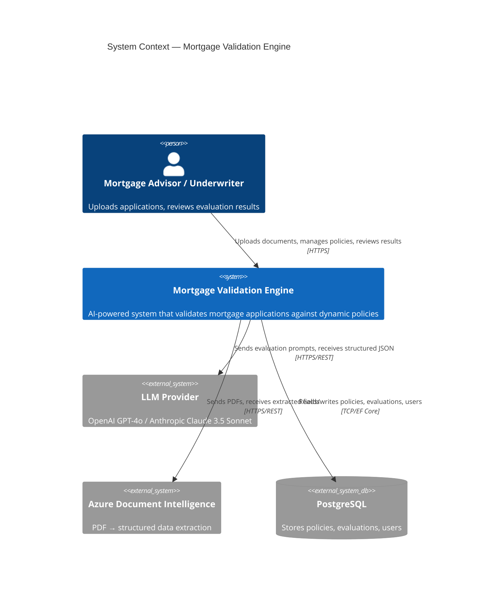
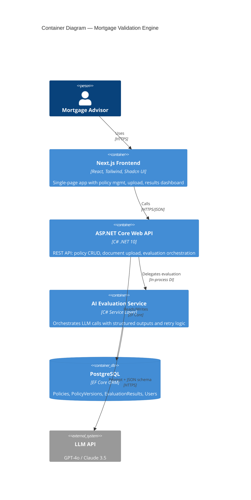
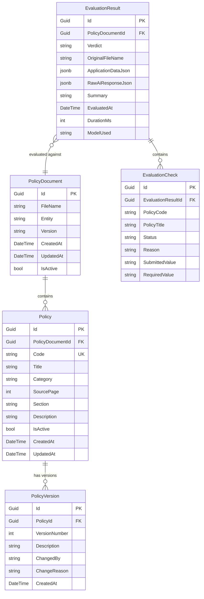

# Implementation Plan: AI-Powered Mortgage & Contract Validation Engine

**Document Version:** 2.0  
**Date:** 2026-02-26  
**Status:** Active  
**Updated:** Reflects token tracking, JSON summarization, data anonymization, and premium UI features  

---

## 1. Architecture Overview

### 1.1 System Context (C4 — Level 1)



### 1.2 Container Diagram (C4 — Level 2)



### 1.3 High-Level Data Flow

```
┌─────────────┐    JSON/PDF     ┌────────────────────┐   EF Core    ┌────────────┐
│  Next.js UI │ ──────────────► │  ASP.NET Core API  │ ◄──────────► │ PostgreSQL │
│  (React)    │ ◄────────────── │  (Controllers)     │              │            │
└─────────────┘   Eval Result   │                    │              └────────────┘
                                │  ┌──────────────┐  │
                                │  │ AI Evaluation │  │    Structured   ┌─────────┐
                                │  │ Service       │──┼──── Prompt ───► │ LLM API │
                                │  │ (Orchestrator)│◄─┼── JSON Output ─ │ GPT-4o  │
                                │  └──────────────┘  │                  └─────────┘
                                └────────────────────┘
```

---

## 2. Architecture Decision Records (ADRs)

### ADR-001: Database — PostgreSQL over SQL Server

| Aspect | Decision |
|--------|----------|
| **Context** | Need a relational DB for structured policy data, versioning, and evaluation results. Both PostgreSQL and SQL Server are specified as options. |
| **Decision** | Use **PostgreSQL** with Npgsql + EF Core. |
| **Rationale** | Lower licensing cost for B2B SaaS, native JSONB support for storing raw application payloads, excellent cloud portability (Azure Database for PostgreSQL, AWS RDS, etc.). |
| **Consequences** | Requires Npgsql NuGet package. Team must use PostgreSQL-compatible SQL syntax. JSONB columns give flexibility for semi-structured mortgage data. |

### ADR-002: AI Provider — Dual-provider with Structured Outputs

| Aspect | Decision |
|--------|----------|
| **Context** | Evaluation engine must produce deterministic, strongly-typed JSON. Need resilience against provider outages. |
| **Decision** | Primary: **OpenAI GPT-4o** via Azure OpenAI SDK with JSON Schema mode. Fallback: Anthropic Claude 3.5 Sonnet. Abstract behind `IEvaluationProvider` interface. |
| **Rationale** | OpenAI's structured output (response_format: json_schema) guarantees schema compliance. Anthropic as fallback provides resilience. |
| **Consequences** | Must maintain prompt parity across providers. Retry/fallback logic adds ~200 lines of orchestration code. |

### ADR-003: Frontend — Next.js App Router + Shadcn UI

| Aspect | Decision |
|--------|----------|
| **Context** | Enterprise B2B UI needs professional look, fast iteration, and good DX. |
| **Decision** | **Next.js 14 (App Router)** + **Tailwind CSS** + **Shadcn UI** (built on Radix primitives). |
| **Rationale** | Shadcn provides copy-paste components that are fully customizable (not a locked dependency). Radix provides accessible primitives. TanStack Query (React Query) for data fetching. |
| **Consequences** | Frontend team needs familiarity with RSC (React Server Components) patterns. Shadcn components are checked into source. |

### ADR-004: Backend Architecture — Clean Architecture with MediatR

| Aspect | Decision |
|--------|----------|
| **Context** | Need separation of concerns, testability, and clear domain boundaries. |
| **Decision** | 4-layer **Clean Architecture**: Domain → Application (MediatR handlers) → Infrastructure (EF Core, AI clients) → API (Controllers). |
| **Rationale** | MediatR decouples controllers from business logic. Repository pattern over EF Core for testability. Strongly typed configuration via `IOptions<T>`. |
| **Consequences** | Slightly more boilerplate than minimal API, but pays off in maintainability and testing. |

### ADR-005: Token Usage Tracking

| Aspect | Decision |
|--------|----------|
| **Context** | OpenAI token consumption is the primary cost driver. Without per-call visibility, optimization decisions are based on guesswork. |
| **Decision** | Track prompt tokens, completion tokens, and total tokens for every LLM interaction. Surface in API response and frontend. |
| **Rationale** | Zero additional API calls — token counts are extracted from existing OpenAI response bodies. Enables data-driven optimization and cost monitoring. |
| **Consequences** | Requires `TokenUsageDto`, `EmbeddingResultDto`, `AiProviderResult` DTOs. Changed `IEvaluationProvider` and `IEmbeddingService` return types. |

### ADR-006: Application JSON Summarization

| Aspect | Decision |
|--------|----------|
| **Context** | Raw mortgage JSON payloads are ~22 KB (~5,600 tokens). Most fields (UUIDs, internal codes) are irrelevant to policy compliance. |
| **Decision** | Implement `ApplicationJsonSummarizer` — a whitelist-based static utility that extracts only decision-relevant fields (~30%) before LLM evaluation. |
| **Rationale** | ~75–80% reduction in application data tokens. Improves evaluation quality by reducing noise. Static with no dependencies — easy to test. |
| **Consequences** | Whitelist must be updated when new policy-relevant fields are introduced. Tightly coupled to Dutch AMA mortgage JSON format. |

### ADR-007: Data Anonymization Before LLM Evaluation

| Aspect | Decision |
|--------|----------|
| **Context** | Mortgage applications contain PII (DOB, nationalities, employment dates). Sending raw PII to external LLM creates privacy risk. Removing fields would degrade evaluation quality. |
| **Decision** | Implement `ApplicationDataAnonymizer` — replaces PII with **functional equivalents** (DOB→age, country→zone, start date→tenure). Generate transparency report. |
| **Rationale** | Preserves evaluation quality (policies reference age ranges, not exact DOBs). Full user transparency via "Data Privacy Shield" panel. Zone classification (NL/EU_EEA/NON_EU) aligns with policy rule granularity. |
| **Consequences** | Anonymization is irreversible by design. Country zone mapping (31 EU/EEA/CH countries) requires code update for new member states. Original data preserved in `ApplicationDataJson` JSONB column. |

### ADR-008: API Documentation — Scalar over Swashbuckle

| Aspect | Decision |
|--------|----------|
| **Context** | Need interactive API documentation for the .NET 10 backend. Swashbuckle has been deprecated for .NET 10+. |
| **Decision** | Use **Scalar.AspNetCore** (2.4.18) + **Microsoft.AspNetCore.OpenApi** for OpenAPI document generation and interactive API documentation. |
| **Rationale** | Scalar provides a modern, interactive UI. First-party `Microsoft.AspNetCore.OpenApi` aligns with .NET 10 direction. |
| **Consequences** | Replaced `AddSwaggerGen()` + `UseSwagger()` with `AddOpenApi()` + `MapOpenApi()` + `MapScalarApiReference()` in Program.cs. |

---

## 3. Database Schema (EF Core Entities)

### 3.1 Entity Relationship Diagram



### 3.2 Key Design Decisions

| Column | Type | Rationale |
|--------|------|-----------|
| `ApplicationDataJson` | `jsonb` | Store the raw AMA/mortgage JSON payload for auditability without rigid schema coupling |
| `RawAiResponseJson` | `jsonb` | Store complete LLM response for debugging and compliance auditing |
| `Policy.Code` | Unique Index | Enables policy-code references in evaluation checks (e.g., `ASN-001`) |
| `Verdict` | `string` (enum-backed) | `APPROVED`, `REJECTED`, `MANUAL_REVIEW` — stored as string for DB portability |

---

## 4. API Endpoint Design

| Method | Route | Purpose | Request | Response |
|--------|-------|---------|---------|----------|
| `GET` | `/api/policies` | List all policies (filterable) | `?category=Risk&entity=ASN` | `PolicyDto[]` |
| `GET` | `/api/policies/{id}` | Get single policy with versions | — | `PolicyDetailDto` |
| `POST` | `/api/policies` | Create/merge new policy (AI-assisted) | `CreatePolicyRequest` | `PolicyDto` |
| `PUT` | `/api/policies/{id}` | Update policy | `UpdatePolicyRequest` | `PolicyDto` |
| `DELETE` | `/api/policies/{id}` | Soft-delete policy | — | `204` |
| `POST` | `/api/policies/import` | Bulk import from JSON file | `PolicyDocument JSON` | `ImportResultDto` |
| `POST` | `/api/evaluations` | Upload & evaluate document | `multipart/form-data` (JSON/PDF) | `EvaluationResultDto` |
| `GET` | `/api/evaluations` | List past evaluations | `?page=1&size=20` | `PaginatedResult<EvaluationSummaryDto>` |
| `GET` | `/api/evaluations/{id}` | Get full evaluation detail | — | `EvaluationResultDto` |

---

## 5. AI Evaluation Engine — Prompt Architecture

### 5.1 Prompt Structure

```
SYSTEM: You are a Dutch mortgage policy compliance engine.
        You evaluate mortgage applications against a set of business policies.
        Return ONLY valid JSON matching the provided schema.

USER:   ## Active Policies
        {serialized policies array}
        
        ## Mortgage Application Data  
        {serialized application JSON}
        
        ## Instructions
        Evaluate the application against ALL active policies.
        For each policy, determine: PASS, FAIL, or WARNING.
        Provide specific field values from the application that led to each determination.
```

### 5.2 Structured Output Schema (C# Record)

```csharp
public record EvaluationResponse
{
    public string Verdict { get; init; }            // APPROVED | REJECTED | MANUAL_REVIEW
    public string Summary { get; init; }            // Human-readable 2-3 sentence summary
    public List<CheckResult> PassedChecks { get; init; }
    public List<CheckResult> FailedChecks { get; init; }
    public List<CheckResult> Warnings { get; init; }
}

public record CheckResult
{
    public string PolicyCode { get; init; }         // e.g., "ASN-001"
    public string PolicyTitle { get; init; }
    public string Status { get; init; }             // PASS | FAIL | WARNING
    public string Reason { get; init; }             // Human-readable explanation
    public string SubmittedValue { get; init; }     // What the application stated
    public string RequiredValue { get; init; }      // What the policy requires
}
```

---

## 6. Frontend Component Tree

```
App (Next.js App Router)
├── layout.tsx (Sidebar nav, top bar, theme)
├── /dashboard
│   └── page.tsx → <DashboardPage>
│       ├── <StatsCards>           (Total policies, recent evaluations, pass rate)
│       └── <RecentEvaluations>   (Table with verdict badges)
├── /policies
│   ├── page.tsx → <PoliciesPage>
│   │   ├── <PolicyFilters>       (Category, entity, search)
│   │   └── <PolicyDataTable>     (Sortable, paginated)
│   ├── [id]/page.tsx → <PolicyDetailPage>
│   │   ├── <PolicyCard>
│   │   └── <PolicyVersionHistory>
│   └── new/page.tsx → <CreatePolicyPage>
│       └── <PolicyForm>          (AI-assisted merge form)
├── /evaluate
│   └── page.tsx → <EvaluatePage>
│       ├── <FileUploadZone>      (Drag-and-drop, JSON/PDF)
│       ├── <EntitySelector>      (Select which policy set to evaluate against)
│       └── <EvaluationProgress>  (Loading state with steps)
├── /evaluations
│   ├── page.tsx → <EvaluationsListPage>
│   │   └── <EvaluationsDataTable>
│   └── [id]/page.tsx → <EvaluationDetailPage>
│       ├── <VerdictBanner>       (APPROVED/REJECTED/MANUAL_REVIEW with color)
│       ├── <SummaryCard>         (AI-generated human-readable summary)
│       ├── <ChecksAccordion>     (Expandable pass/fail/warning items)
│       │   ├── <PassedCheckItem> (Green, collapsible)
│       │   ├── <FailedCheckItem> (Red, expanded by default)
│       │   └── <WarningCheckItem>(Amber)
│       └── <RawDataTab>          (Collapsible JSON viewer)
└── Shared Components
    ├── <Badge>                   (Status badges: pass/fail/warning/verdict)
    ├── <DataTable>               (Reusable table with sorting/filtering)
    ├── <FileDropzone>            (Drag-and-drop with file type validation)
    ├── <PageHeader>              (Title + breadcrumbs + actions)
    ├── <Sidebar>                 (Navigation)
    ├── <StatusDot>               (Traffic light indicator)
    └── <LoadingSpinner>
```

---

## 7. Security Considerations

| Threat (OWASP) | Mitigation |
|-----------------|------------|
| **Injection** | EF Core parameterized queries; input validation via FluentValidation |
| **Broken Authentication** | JWT Bearer tokens; ASP.NET Identity (future phase) |
| **Sensitive Data Exposure** | Files processed in-memory only (no disk persistence); HTTPS enforced |
| **XXE / File Upload** | Validate file type + size; parse JSON in sandboxed deserialization; PDF processed via Azure DI (no local parsing) |
| **Mass Assignment** | Explicit DTOs with AutoMapper/manual mapping; never bind directly to entities |
| **SSRF** | AI provider URLs are hardcoded in configuration; no user-controllable URLs |

---

## 8. Project Structure

```
PolicyValidationEngine/
├── src/
│   ├── PolicyEngine.Domain/          # Entities, Enums, Value Objects
│   ├── PolicyEngine.Application/     # MediatR Handlers, DTOs, Interfaces
│   ├── PolicyEngine.Infrastructure/  # EF Core DbContext, AI Service, Repositories
│   ├── PolicyEngine.API/             # ASP.NET Core Controllers, Middleware, Program.cs
│   └── PolicyEngine.Web/             # Next.js Frontend (standalone)
├── tests/
│   ├── PolicyEngine.UnitTests/
│   └── PolicyEngine.IntegrationTests/
├── seed/                             # Sample policy JSON files for seeding
└── docs/                             # Architecture docs
```

---

## 9. Implementation Phases

### Phase 1 — Foundation ✅
- [x] Create implementation plan
- [x] Scaffold ASP.NET Core solution with Clean Architecture layers
- [x] Define EF Core entities + DbContext + migrations
- [x] Implement Policy CRUD API endpoints
- [x] Scaffold Next.js + Tailwind UI with basic layout
- [x] Build Policy Management UI (datatable, filters, CRUD)
- [x] Seed database with provided ASN/MUNT policies

### Phase 2 — AI Evaluation Core ✅
- [x] Implement AI Evaluation Service with structured output
- [x] Build document upload endpoint (JSON parsing)
- [x] Create evaluation results storage
- [x] Build Evaluation UI (upload zone + results dashboard)
- [x] Implement retry/fallback logic for LLM calls

### Phase 3 — RAG & Performance ✅
- [x] pgvector integration + policy embedding pipeline
- [x] Semantic retrieval (PgVectorPolicyRetriever)
- [x] Hybrid strategy (semantic + mandatory categories + fallback)
- [x] Token usage tracking across all LLM interactions
- [x] Application JSON summarization (~75–80% token reduction)
- [x] Retrieval observability (RetrievedPolicyCount vs TotalPolicyCount)

### Phase 4 — Privacy & Premium UX ✅
- [x] Data anonymization before LLM (PII → functional equivalents)
- [x] Anonymization transparency (user-facing "Data Privacy Shield")
- [x] Application preview before evaluation (7-section premium form)
- [x] Premium form redesign (gradient hero, animated gauges, staggered animations)
- [x] Token usage panel (per-evaluation cost visibility)
- [x] Retrieved vectors panel (RAG observability)

### Phase 5 — Production Readiness (Planned)
- [ ] PDF upload + Azure Document Intelligence integration
- [ ] Policy versioning UI
- [ ] AI-assisted policy merge (conflict detection)
- [ ] Authentication & authorization (ASP.NET Identity + JWT)
- [ ] Global error handling, logging (Serilog), health checks
- [ ] CI/CD pipeline configuration
- [ ] Rate limiting middleware

---

## 10. Technology Matrix

| Layer | Technology | Version | NuGet/NPM Package |
|-------|-----------|---------|-------------------|
| API Runtime | .NET | 10.0 | — |
| Web Framework | ASP.NET Core | 10.0 | `Microsoft.AspNetCore.App` |
| ORM | Entity Framework Core | 10.0.0 | `Microsoft.EntityFrameworkCore` |
| DB Provider | Npgsql | 10.0.0 | `Npgsql.EntityFrameworkCore.PostgreSQL` |
| Vector Search | pgvector | 0.3.0 / 0.3.2 | `Pgvector.EntityFrameworkCore` / `Pgvector` |
| API Docs | Scalar | 2.4.18 | `Scalar.AspNetCore` |
| OpenAPI | Microsoft | 10.0.0 | `Microsoft.AspNetCore.OpenApi` |
| AI SDK | Azure OpenAI | 2.1.0 | `Azure.AI.OpenAI` |
| PDF Parsing | PdfPig | 1.7.0 | `UglyToad.PdfPig` |
| Serialization | System.Text.Json | 10.0 | Built-in |
| Frontend | Next.js | 16.x | `next` |
| UI Components | Radix UI | Latest | `@radix-ui/*`, `class-variance-authority` |
| Styling | Tailwind CSS | 4.x | `tailwindcss` |
| Data Fetching | TanStack Query | 5.x | `@tanstack/react-query` |
| HTTP Client | Axios | 1.x | `axios` |
| Icons | Lucide React | Latest | `lucide-react` |
