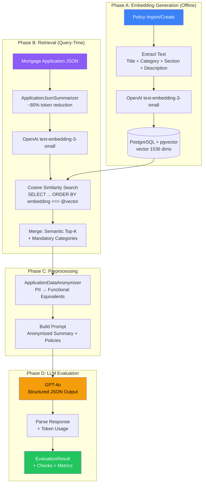
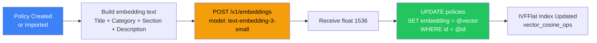
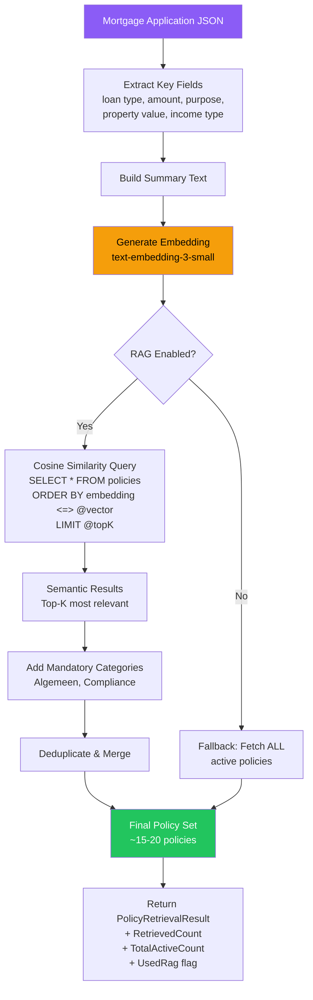
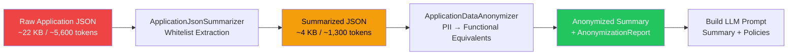
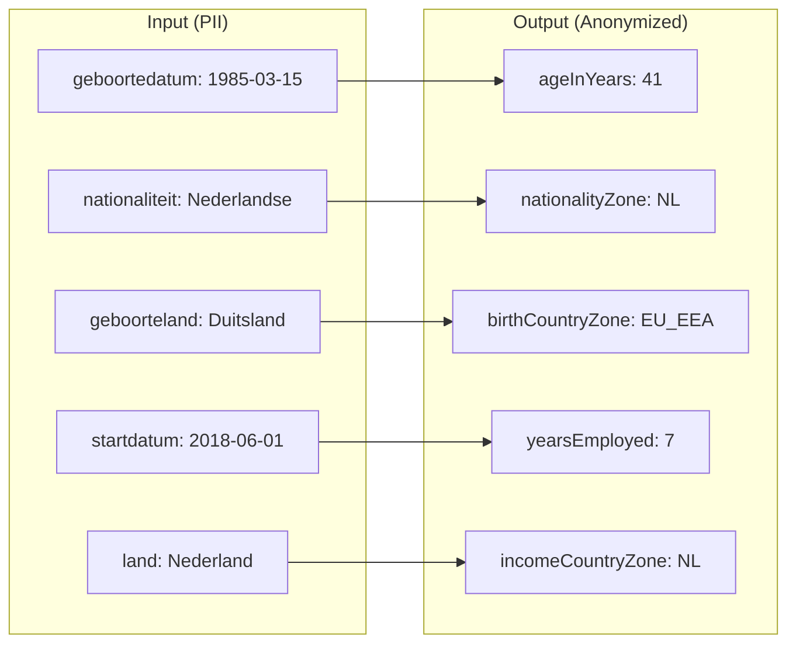
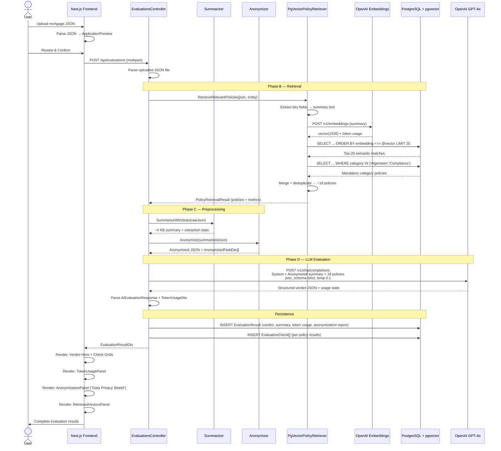
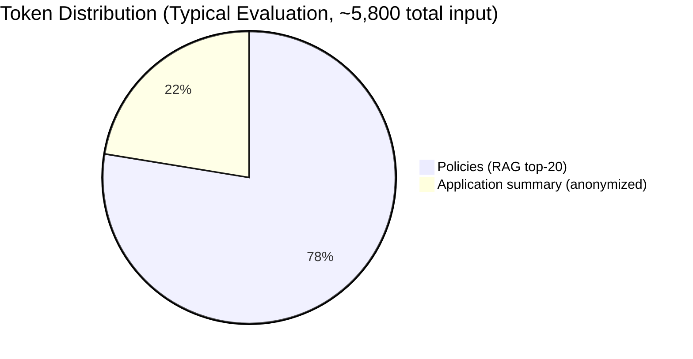

# RAG Architecture — End-to-End Guide

> **Retrieval-Augmented Generation (RAG)** for the PolicyEngine mortgage compliance evaluation system.

This document explains how RAG works end-to-end in PolicyEngine — from policy embedding generation through query-time retrieval, preprocessing (summarization + anonymization), LLM evaluation, and result delivery. It also documents the original architectural decision and token economics.

---

## Table of Contents

1. [What Is RAG and Why We Use It](#1-what-is-rag-and-why-we-use-it)
2. [Architecture Overview](#2-architecture-overview)
3. [Phase A — Policy Embedding Generation](#3-phase-a--policy-embedding-generation)
4. [Phase B — Evaluation-Time Retrieval](#4-phase-b--evaluation-time-retrieval)
5. [Phase C — Preprocessing Pipeline](#5-phase-c--preprocessing-pipeline)
6. [Phase D — LLM Evaluation](#6-phase-d--llm-evaluation)
7. [End-to-End Sequence](#7-end-to-end-sequence)
8. [Token Economics](#8-token-economics)
9. [Technology Selection (ADR-001)](#9-technology-selection-adr-001)
10. [Configuration Reference](#10-configuration-reference)
11. [Observability & Safety](#11-observability--safety)
12. [Future Enhancements](#12-future-enhancements)

---

## 1. What Is RAG and Why We Use It

**Problem:** The PolicyEngine evaluates mortgage applications against a growing corpus of business policies. Sending *all* active policies (currently 44, potentially 200+) to GPT-4o for every evaluation:

- Wastes tokens on irrelevant policies (e.g., sending "Compliance" rules when evaluating a "Finance" question)
- Increases latency proportionally with corpus size
- Costs scale **O(N)** where N is total policies

**Solution:** RAG uses **semantic similarity search** to retrieve only the most relevant policies for each specific application, keeping prompt size **O(K)** where K is a fixed top-K parameter (default: 20).

```
┌─────────────────────────────────────────────────────────────────────┐
│                         Without RAG                                  │
│  All 44 policies ──────────────────────────────────────▶ GPT-4o     │
│  (~10,000 tokens)                                                    │
├─────────────────────────────────────────────────────────────────────┤
│                          With RAG                                    │
│  Application ──▶ Embed ──▶ Similarity Search ──▶ Top 15-20 policies │
│                                                   (~4,500 tokens)   │
│                                                       ▼             │
│                                                    GPT-4o           │
└─────────────────────────────────────────────────────────────────────┘
```

---

## 2. Architecture Overview



---

## 3. Phase A — Policy Embedding Generation

Embeddings are generated **once per policy** at creation/import time and stored alongside the policy record in PostgreSQL.

### Embedding Text Strategy

Each policy's embedding input is a concatenation of its most meaningful fields:

```
"{Title}. {Category}. {Section}. {Description}"
```

Example:
```
"Maximale hypotheek. Lending Limits. 2.1. De maximale hypotheek bedraagt 100% van de marktwaarde..."
```

### Embedding Pipeline Flowchart



### Triggers

| Event | Embedding Action |
|---|---|
| `POST /api/policies` (create) | Embed immediately after persistence |
| `POST /api/policies/import` (bulk JSON) | Embed each policy after creation |
| `POST /api/policies/upload` (smart upload) | Embed each CREATED policy |
| `POST /api/policies/reindex-embeddings` | Backfill missing or re-embed all (`?forceAll=true`) |
| Policy update (`PUT /api/policies/{id}`) | Re-embed with new description |

### Storage

| Column | Type | Index |
|---|---|---|
| `policies.embedding` | `vector(1536)` | IVFFlat (`vector_cosine_ops`) |

The IVFFlat index provides **Approximate Nearest Neighbor (ANN)** search — fast at scale, with a small accuracy trade-off vs. exact search.

---

## 4. Phase B — Evaluation-Time Retrieval

When a mortgage application is submitted for evaluation, the system retrieves only the most relevant policies using a **hybrid strategy** combining semantic similarity with mandatory category inclusion.

### Retrieval Flowchart



### Hybrid Strategy Details

The `PgVectorPolicyRetriever` implements a two-layer retrieval:

1. **Semantic layer** — Cosine similarity search (`<=>` operator) over the `embedding` column, limited to `TopK` (default 20) results. If an entity filter is provided, results are scoped to that entity's policies.

2. **Safety layer** — Mandatory categories (configured in `RAG:AlwaysIncludeCategories`) are always included regardless of similarity score. This ensures compliance-critical policies (e.g., "Algemeen", "Compliance") are never dropped.

3. **Deduplication** — Semantic results and mandatory results are merged, removing duplicates by policy ID.

4. **Fallback** — If the embedding service is unavailable or RAG is disabled, the system falls back to the full active policy set. The evaluation proceeds without RAG rather than failing.

### SQL Query (Simplified)

```sql
-- Semantic retrieval
SELECT p.*, p.embedding <=> @queryVector AS distance
FROM policies p
WHERE p.is_active = true
  AND (@entity IS NULL OR pd.entity = @entity)
ORDER BY p.embedding <=> @queryVector
LIMIT @topK;

-- Mandatory categories (always included)
SELECT p.*
FROM policies p
WHERE p.is_active = true
  AND p.category IN ('Algemeen', 'Compliance')
  AND (@entity IS NULL OR pd.entity = @entity);
```

---

## 5. Phase C — Preprocessing Pipeline

Before the retrieved policies and application data are sent to GPT-4o, two preprocessing stages reduce token count and remove PII.

### Preprocessing Flowchart



### Stage 1: Summarization

`ApplicationJsonSummarizer.SummarizeWithStats()` applies a **whitelist** approach:

| What It Keeps (~30%) | What It Strips (~70%) |
|---|---|
| Loan amount, fixed-rate period, NHG flag | Internal UUIDs, routing numbers |
| Property value, WOZ, energy label, build year | Intermediary codes, system timestamps |
| Applicant DOB, nationality, marital status | Bank account details, BSN-related fields |
| Gross income, employer, contract type | API metadata, version identifiers |
| Alimony, student debt, existing mortgages | Duplicate nested objects, empty arrays |
| LTV ratio (computed) | Advisor internal references |

**Result:** ~75–80% reduction in tokens for the application data portion.

### Stage 2: Anonymization

`ApplicationDataAnonymizer.Anonymize()` transforms PII into **functional equivalents**:



**Zone classification:**

| Zone | Countries |
|---|---|
| **NL** | Nederland / Netherlands / Nederlandse |
| **EU_EEA** | 31 EU/EEA/CH member states (Germany, France, Belgium, etc.) |
| **NON_EU** | All other countries |

Each transformation produces an `AnonymizedFieldDto` record for the transparency report:
```json
{
  "originalField": "aanvrager[0].persoon.geboortedatum",
  "category": "Age",
  "originalValue": "1985-03-15",
  "anonymizedValue": "ageInYears: 41"
}
```

---

## 6. Phase D — LLM Evaluation

The preprocessed data (anonymized summary + retrieved policies) is sent to GPT-4o with structured output enforcement.

### Prompt Structure

```
SYSTEM: You are a Dutch mortgage policy compliance engine.
        Evaluate the application against all provided policies.
        Return ONLY valid JSON matching the provided schema.

USER:   ## Active Policies (15 of 44 — retrieved via RAG)
        [serialized policy array]
        
        ## Mortgage Application Data (Summarized & Anonymized)
        [anonymized summary JSON]
        
        ## Instructions
        For each policy: determine PASS, FAIL, or WARNING.
        Provide specific values from the application for each determination.
```

### Structured Output

The response is enforced via `response_format: json_schema` (strict mode):

```json
{
  "verdict": "APPROVED | REJECTED | MANUAL_REVIEW",
  "summary": "Human-readable 2-3 sentence summary",
  "passed": [{ "policyCode": "...", "status": "PASS", "reason": "...", "submittedValue": "...", "requiredValue": "..." }],
  "failed": [...],
  "warnings": [...]
}
```

### Token Usage Extraction

Token counts are extracted from the OpenAI API response body:

```json
{
  "usage": {
    "prompt_tokens": 3200,
    "completion_tokens": 1800,
    "total_tokens": 5000
  }
}
```

These are mapped to `TokenUsageDto` and returned to the frontend as part of `EvaluationResultDto`.

---

## 7. End-to-End Sequence

This diagram shows the complete flow from user upload to rendered results, including all RAG, preprocessing, and evaluation stages.



---

## 8. Token Economics

### Before vs. After Optimization Stack

| Component | Before (v1) | After (v2) | Savings |
|---|---|---|---|
| **Application data** | ~5,600 tokens (raw 22 KB) | ~1,300 tokens (summarized 4 KB) | **~77%** |
| **Policies in prompt** | ~10,000 tokens (all 44) | ~4,500 tokens (RAG top-20) | **~55%** |
| **Total input tokens** | ~15,600 | ~5,800 | **~63%** |
| **Monthly cost** (100 evals/day) | ~$11.70 | ~$4.35 | **~$7.35/mo** |

### Scaling Projection

| Scenario | Policies | Input Tokens (est.) | Monthly Cost (100 evals/day) |
|---|---|---|---|
| Current (RAG + summarization) | 15–20 retrieved | ~5,800 | ~$4.35 |
| 200 total policies (RAG active) | 15–20 retrieved | ~5,800 | ~$4.35 |
| 200 total policies (no RAG) | 200 | ~55,000 | ~$41.25 |
| 500 total policies (RAG active) | 15–20 retrieved | ~5,800 | ~$4.35 |

At scale, RAG keeps cost **constant** regardless of corpus size — prompt size is always **O(K)** not **O(N)**.

### Token Breakdown (Typical Evaluation)



---

## 9. Technology Selection (ADR-001)

### Vector Database

| Option | Pros | Cons | Verdict |
|---|---|---|---|
| **pgvector** (PostgreSQL) | Zero new infra, ACID, familiar | Slower than dedicated vector DBs at >1M vectors | **Selected** |
| Qdrant | Purpose-built, fast, filtering | New container, new ops burden | Overkill |
| Pinecone | Managed SaaS, zero ops | Vendor lock-in, cost, latency | Not justified |
| Azure AI Search | Hybrid search built-in | Expensive, heavy | Not justified |

**Rationale:** The policy corpus is small (<10K vectors) and growth is linear. pgvector keeps the stack simple — one database for relational data, JSONB storage, and vector search.

### Embedding Model

| Model | Dimensions | Cost/1M tokens | Selected |
|---|---|---|---|
| **text-embedding-3-small** | 1536 | $0.02 | Yes |
| text-embedding-3-large | 3072 | $0.13 | No — Overkill |
| text-embedding-ada-002 | 1536 | $0.10 | No — Legacy |

---

## 10. Configuration Reference

```json
{
  "RAG": {
    "Enabled": true,
    "TopK": 20,
    "SimilarityThreshold": 0.3,
    "AlwaysIncludeCategories": ["Algemeen", "Compliance"],
    "EmbeddingModel": "text-embedding-3-small",
    "EmbeddingDimensions": 1536
  }
}
```

| Key | Default | Description |
|---|---|---|
| `Enabled` | `true` | Master switch for RAG retrieval |
| `TopK` | `20` | Max policies from semantic search |
| `SimilarityThreshold` | `0.3` | Minimum cosine similarity (future use) |
| `AlwaysIncludeCategories` | `Algemeen,Compliance` | Safety-net categories always included |
| `EmbeddingModel` | `text-embedding-3-small` | OpenAI embedding model |
| `EmbeddingDimensions` | `1536` | Expected vector dimensionality |

---

## 11. Observability & Safety

### Metrics Tracked

| Metric | Source | Surfaced In |
|---|---|---|
| `RetrievedPolicyCount` | `PgVectorPolicyRetriever` | API response, evaluation detail UI |
| `TotalPolicyCount` | `PgVectorPolicyRetriever` | API response, evaluation detail UI |
| `UsedRag` | `PgVectorPolicyRetriever` | Logged, available in response |
| `PromptTokens` | OpenAI response | TokenUsagePanel (UI) |
| `CompletionTokens` | OpenAI response | TokenUsagePanel (UI) |
| `TotalTokens` | OpenAI response | TokenUsagePanel (UI) |
| `EmbeddingTokens` | OpenAI response | Logged per embedding call |
| `AnonymizedFields` | `ApplicationDataAnonymizer` | AnonymizationPanel (UI) |
| `SummarizedSize` | `ApplicationJsonSummarizer` | Logged with extraction stats |

### Safety Mechanisms

| Mechanism | Description |
|---|---|
| **Mandatory categories** | Compliance-critical policy categories are always included, even if not in semantic top-K |
| **Fallback to full set** | If embedding service fails, all active policies are used (graceful degradation) |
| **Embedding failure isolation** | Policy import/creation succeeds even if embedding generation fails |
| **Reindex endpoint** | `POST /api/policies/reindex-embeddings` backfills missing embeddings |
| **Non-destructive anonymization** | Original data preserved in `ApplicationDataJson` JSONB column |

---

## 12. Future Enhancements

| Enhancement | Description | Priority |
|---|---|---|
| **Re-ranking** | After vector retrieval, use a cross-encoder model to re-rank results | Medium |
| **Chunk-level embeddings** | For very long policy descriptions, embed at paragraph level | Low |
| **Embedding cache** | Cache embedding vectors for identical application structures | Medium |
| **Similarity threshold** | Filter out low-similarity results below `SimilarityThreshold` | Low |
| **Vector DB migration** | If policy count exceeds 100K, consider Qdrant or Milvus | Future |
| **Prompt compression** | Apply token-level compression (e.g., LLMLingua) to further reduce cost | Medium |
| **Multi-language embeddings** | Support policies in multiple languages with multilingual embedding models | Future |
